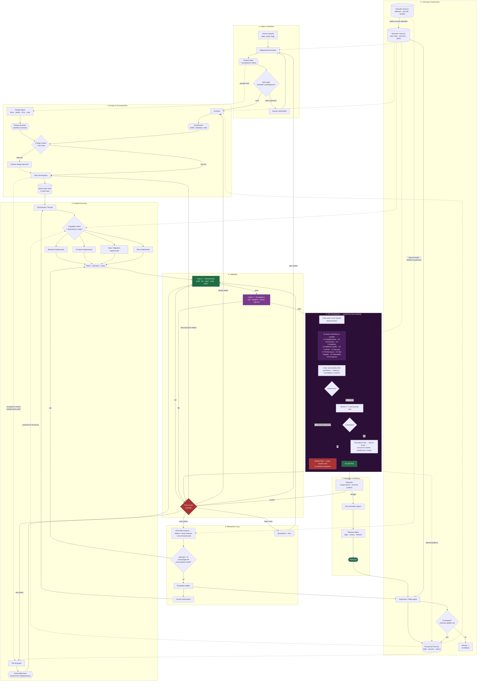

# Multi-Agent AI System for App Development

A reference design for a production-grade multi-agent system that takes a product
request from natural language to released software, with deterministic validation
gates, bounded feedback loops, explicit failure handling, and horizontal scalability.

## Design thesis

Eight principles drive every decision in this design:

1. **Ground truth is deterministic, not conversational.** Compilers, type checkers,
   test runners and scanners decide whether work is correct. LLM agents propose;
   deterministic gates dispose. No agent may declare its own work done.
2. **Separation of duties.** The agent that writes the code never writes its own
   acceptance tests and never approves its own merge. This is the single most
   important defence against agents optimising for "looks finished".
3. **Loops must terminate.** Every refinement cycle carries an attempt counter, a
   token/cost budget, and a no-progress detector. When a loop cannot converge it
   escalates up a fixed ladder and ultimately to a human — it never spins.
4. **State lives outside the agents.** Agents are stateless workers over a durable
   task graph. That is what makes the system restartable, parallelisable, and
   horizontally scalable.
5. **Nothing is remembered unless something writes it down.** Agents are stateless and
   context windows are finite, so memory is explicit infrastructure: a
   [four-layer store](docs/09-memory-and-learning.md) — working, episodic, semantic,
   procedural — with a work journal that survives compaction and lease expiry, and a gated
   promotion path from "this happened once" to "the fleet knows this".
6. **Agents emit artifacts, not narration — and a rejected instance is replaced, not
   coached.** No preamble, no commentary, no explaining what the diff already shows; free
   text survives only where another stage consumes it. When work is rejected the instance is
   terminated and a fresh one of the same role is seated with a ≤2,000-token
   [carry-forward pack](docs/10-token-efficiency.md), because the rejected run's context is
   the longest, most polluted, and most anchored context in the system.
7. **The fleet acquires capabilities and amends itself, under rate limits.** A task nobody is
   specialised for triggers a [three-candidate tournament](docs/11-capability-genesis-and-amendments.md);
   the winner is seated provisionally and becomes permanent only after probation. Any agent
   may propose an optimization; the Commission approves it at 80%, the eval harness proves
   it, and the monitor can revert it. Agents lacking a skill
   [acquire it themselves](docs/12-skill-acquisition.md), from the internet where needed —
   but fetched content is data, never instructions, and a claim is a hypothesis until a
   scratch test confirms it. Constitutional guardrails need a human.
8. **Final acceptance is unanimous, and its judges are term-limited.** A ten-seat
   [Commission](docs/07-commission.md) holds absolute authority at the last gate: one
   dissent voids everything until the objection is fixed. Each seat serves three passings,
   then hands a validated Precedent Pack to a successor — so the standard compounds across
   generations instead of dying with an agent's context window.

## Documentation map

| Document | Contents |
|---|---|
| [`docs/01-architecture.md`](docs/01-architecture.md) | Layered topology, master flowchart, task state machine, control plane |
| [`docs/02-agent-specs.md`](docs/02-agent-specs.md) | Every agent: role, inputs, outputs, design logic, guardrails, exit criteria |
| [`docs/03-routing-and-validation.md`](docs/03-routing-and-validation.md) | Routing rules, the three validation gates, root-cause driven feedback loops |
| [`docs/04-failure-handling.md`](docs/04-failure-handling.md) | Failure taxonomy, retry/escalation ladder, circuit breakers, rollback |
| [`docs/05-optimization-and-scaling.md`](docs/05-optimization-and-scaling.md) | Cost/latency/quality optimisation, scaling model, capacity and governance |
| [`docs/06-implementation-guide.md`](docs/06-implementation-guide.md) | Stack choices, phased rollout, metrics, anti-patterns |
| [`docs/07-commission.md`](docs/07-commission.md) | The Commission: ten-seat unanimous adjudication, dissent lifecycle, tenure and succession |
| [`docs/08-agent-skills-and-tools.md`](docs/08-agent-skills-and-tools.md) | Skills, tools and connectors per agent; the Design Agent; permission matrix |
| [`docs/09-memory-and-learning.md`](docs/09-memory-and-learning.md) | Four-layer memory, compaction, work journals, the learning loop, memory integrity |
| [`docs/10-token-efficiency.md`](docs/10-token-efficiency.md) | Output discipline, per-role budgets, reasoning depth, instance replacement |
| [`docs/11-capability-genesis-and-amendments.md`](docs/11-capability-genesis-and-amendments.md) | Three-candidate tournaments for missing capabilities; 80% Commission amendment process |
| [`docs/12-skill-acquisition.md`](docs/12-skill-acquisition.md) | Agents acquiring missing skills themselves, including from the internet, with verification |
| [`docs/13-token-model.md`](docs/13-token-model.md) | Cost model: tokens per work order and per minute, optimized vs unoptimized |
| [`docs/14-optimization-backlog.md`](docs/14-optimization-backlog.md) | Remaining optimizations: implemented, proposed, rejected, and the work-order sizing lever |
| [`docs/15-review-findings.md`](docs/15-review-findings.md) | Commission review of this design: 22 findings, 4/4 seats dissenting, 18 remediated |
| [`docs/16-specifications.md`](docs/16-specifications.md) | Filled specifications: risk and root-cause classifiers, the three undefined gates, golden set, *q*, thresholds, Policy Engine |
| [`CLAUDE.md`](CLAUDE.md) | Session economy — output discipline for anyone (human or agent) working in this repo |
| [`schemas/`](schemas/) | JSON Schemas for the message contracts between agents |

## Master flowchart

## The one-paragraph version

A **Requirements Analyst** turns a request into a testable spec; an **Architect** turns
the spec into interface contracts and an **ADR** trail; a **Decomposer** turns that into a
DAG of small work orders, each carrying its own acceptance criteria. An **Orchestrator**
schedules ready work orders onto pools of specialised **Implementers**, while a separate
**Test Engineer** writes the acceptance tests those implementers are not allowed to edit.
Every patch runs the **Gate 0** deterministic suite, then **Gate 2** acceptance and human
sign-off for risky classes. Semantic review — correctness, security, performance — is not a
separate gate: it lives in the Commission seats that hold those jurisdictions. Any failure is classified by root cause and routed back to the *specific*
stage that caused it — code, tests, decomposition, design, or spec — under a hard attempt
and budget ceiling with no-progress detection. Exhausted loops climb an escalation ladder
(retry → stronger model → repair specialist → re-plan → human). Work that survives all three
gates then faces the **Commission**: ten seats with disjoint jurisdictions — requirements,
correctness, completion, method and skills, contracts, security, performance, test
integrity, operability, and evidence — voting blind and in parallel, where a single
admissible dissent voids the entire adjudication until that point is fixed. Each seat serves
**three passings**, then hands a **Precedent Pack** of what it approved and what it rejected
to a successor that must reproduce established rulings on sealed historical cases before
being seated. Accepted work passes through a serialised **merge queue** with
semantic-conflict detection, ships behind feature flags with automated rollback, and every
escalation and rejected pattern deposits a **lesson** that is injected into future agent
prompts and added to the evaluation suite.

## Quick reference: agents at a glance

| Agent | Consumes | Produces | Blocking authority |
|---|---|---|---|
| Orchestrator | Task graph, worker health | Assignments, budgets | Can halt any branch |
| Requirements Analyst | Human request, product context | Product Spec, acceptance criteria | Blocks on ambiguity |
| Architect | Product Spec | ADRs, interface contracts, risk register | Blocks on infeasibility |
| Design Agent | Product Spec, design system | Flows, state inventory, a11y annotations, copy | Blocks on undefined states |
| Task Decomposer | Architecture + spec | Work-order DAG | Blocks on unsizable work |
| Implementers (×N) | Work order, contracts, repo context | Patch, self-tests, notes | None |
| Test Engineer | Acceptance criteria, contracts | Executable test suites | Owns test files |
| Verifier (deterministic) | Patch + tests | Machine verdict | **Hard block** |
| Correctness · Security · Performance | Diff, contracts, threat model, budgets | Findings with severity | Seats C2 / C6 / C7 — absolute veto |
| Refiner | Failure bundle | Minimal corrective patch | None |
| **Commission (10 seats)** | Sealed case dossier | Unanimous verdict, dissents, precedent | **Absolute — any one seat voids all** |
| Integrator | Commission-accepted patches | Merge, conflict resolution | Blocks on conflict |
| Documentation Agent | Merged diff, ADRs | Docs, changelog | None |
| Release Agent | Merged main | Deploy, canary, rollback | **Hard block** on canary regression |
| Memory Curator | All artifacts | Context packs, repo map, retrieval, pruning | None |
| Supervisor | Metrics, escalations | Lessons, routing tuning, alerts | Can trip circuit breakers |

See [`docs/02-agent-specs.md`](docs/02-agent-specs.md) for the full specification of each,
and [`docs/07-commission.md`](docs/07-commission.md) for the ten Commission seats.

## The Commission in brief

| | |
|---|---|
| **Composition** | 10 seats, disjoint jurisdictions, read-only, blind parallel voting. **Low-risk work seats 5** (C1, C2, C3, C8, C10) — the jurisdictions with no deterministic backstop; promotion to full bench is deterministic and mandatory on any security, contract, migration or infra path |
| **Decision rule** | Unanimity. One admissible dissent voids the entire adjudication — no partial acceptance |
| **Dissent validity** | Must state jurisdiction, cite evidence, name a concrete failure, and give an objectively checkable clearance condition |
| **Clearance** | Only the issuing seat — or its successor — may clear its own dissent |
| **Tenure** | 3 passings, then mandatory succession (hard backstop at 12 adjudications) |
| **Succession** | Precedent Pack → Bench Exam on 12 sealed cases → successor seated, predecessor retired |
| **Improvement** | Rejected patterns feed back into implementer prompts; per-seat precision tracked across generations |
| **On rejection** | The producing instance is terminated and replaced with a fresh one of the same role carrying a ≤2,000-token carry-forward pack — never coached |
| **Vote cost** | PASS carries no rationale (≤50 tokens); rationale is mandatory only on dissent |
| **Bounded by** | 3 adjudication rounds, contradiction detection, human arbitration |
