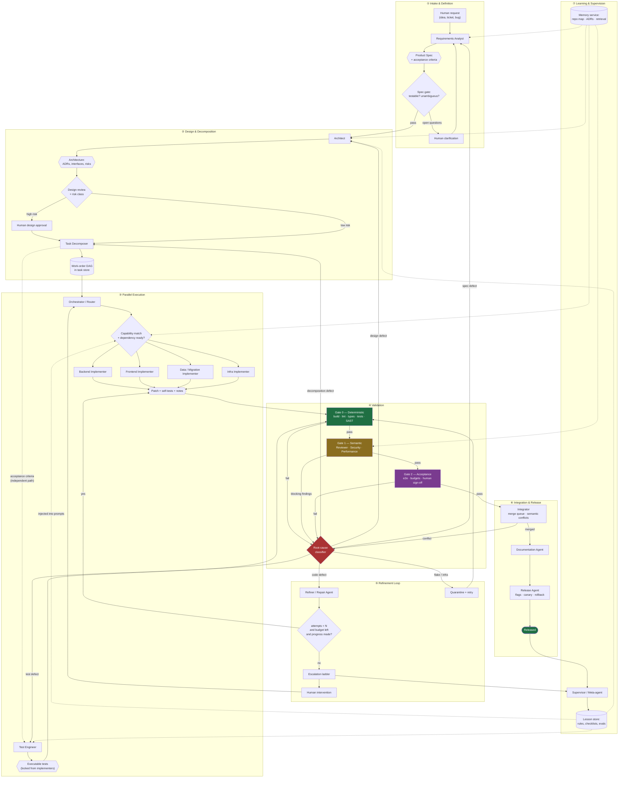

# Multi-Agent AI System for App Development

A reference design for a production-grade multi-agent system that takes a product
request from natural language to released software, with deterministic validation
gates, bounded feedback loops, explicit failure handling, and horizontal scalability.

## Design thesis

Four principles drive every decision in this design:

1. **Ground truth is deterministic, not conversational.** Compilers, type checkers,
   test runners and scanners decide whether work is correct. LLM agents propose;
   deterministic gates dispose. No agent may declare its own work done.
2. **Separation of duties.** The agent that writes the code never writes its own
   acceptance tests and never approves its own merge. This is the single most
   important defence against agents optimising for "looks finished".
3. **Loops must terminate.** Every refinement cycle carries an attempt counter, a
   token/cost budget, and a no-progress detector. When a loop cannot converge it
   escalates up a fixed ladder and ultimately to a human — it never spins.
4. **State lives outside the agents.** Agents are stateless workers over a durable
   task graph. That is what makes the system restartable, parallelisable, and
   horizontally scalable.

## Documentation map

| Document | Contents |
|---|---|
| [`docs/01-architecture.md`](docs/01-architecture.md) | Layered topology, master flowchart, task state machine, control plane |
| [`docs/02-agent-specs.md`](docs/02-agent-specs.md) | Every agent: role, inputs, outputs, design logic, guardrails, exit criteria |
| [`docs/03-routing-and-validation.md`](docs/03-routing-and-validation.md) | Routing rules, the three validation gates, root-cause driven feedback loops |
| [`docs/04-failure-handling.md`](docs/04-failure-handling.md) | Failure taxonomy, retry/escalation ladder, circuit breakers, rollback |
| [`docs/05-optimization-and-scaling.md`](docs/05-optimization-and-scaling.md) | Cost/latency/quality optimisation, scaling model, capacity and governance |
| [`docs/06-implementation-guide.md`](docs/06-implementation-guide.md) | Stack choices, phased rollout, metrics, anti-patterns |
| [`schemas/`](schemas/) | JSON Schemas for the message contracts between agents |

## Master flowchart

## The one-paragraph version

A **Requirements Analyst** turns a request into a testable spec; an **Architect** turns
the spec into interface contracts and an **ADR** trail; a **Decomposer** turns that into a
DAG of small work orders, each carrying its own acceptance criteria. An **Orchestrator**
schedules ready work orders onto pools of specialised **Implementers**, while a separate
**Test Engineer** writes the acceptance tests those implementers are not allowed to edit.
Every patch runs the **Gate 0** deterministic suite, then LLM **Gate 1** review
(correctness, security, performance), then **Gate 2** acceptance and human sign-off for
risky classes. Any failure is classified by root cause and routed back to the *specific*
stage that caused it — code, tests, decomposition, design, or spec — under a hard attempt
and budget ceiling with no-progress detection. Exhausted loops climb an escalation ladder
(retry → stronger model → repair specialist → re-plan → human). Merges pass through a
serialised **merge queue** with semantic-conflict detection, ship behind feature flags with
automated rollback, and every escalation deposits a **lesson** that is injected into future
agent prompts and added to the evaluation suite.

## Quick reference: agents at a glance

| Agent | Consumes | Produces | Blocking authority |
|---|---|---|---|
| Orchestrator | Task graph, worker health | Assignments, budgets | Can halt any branch |
| Requirements Analyst | Human request, product context | Product Spec, acceptance criteria | Blocks on ambiguity |
| Architect | Product Spec | ADRs, interface contracts, risk register | Blocks on infeasibility |
| Task Decomposer | Architecture + spec | Work-order DAG | Blocks on unsizable work |
| Implementers (×N) | Work order, contracts, repo context | Patch, self-tests, notes | None |
| Test Engineer | Acceptance criteria, contracts | Executable test suites | Owns test files |
| Verifier (deterministic) | Patch + tests | Machine verdict | **Hard block** |
| Code Reviewer | Diff, contracts, lessons | Findings with severity | Blocks on ≥ major |
| Security Agent | Diff, threat model, deps | Vulnerability findings | **Hard block** on high |
| Performance Agent | Diff, benchmarks, budgets | Regression report | Blocks on budget breach |
| Refiner | Failure bundle | Minimal corrective patch | None |
| Integrator | Approved patches | Merge, conflict resolution | Blocks on conflict |
| Documentation Agent | Merged diff, ADRs | Docs, changelog | None |
| Release Agent | Merged main | Deploy, canary, rollback | **Hard block** on canary regression |
| Memory Curator | All artifacts | Repo map, retrieval, summaries | None |
| Supervisor | Metrics, escalations | Lessons, routing tuning, alerts | Can trip circuit breakers |

See [`docs/02-agent-specs.md`](docs/02-agent-specs.md) for the full specification of each.
