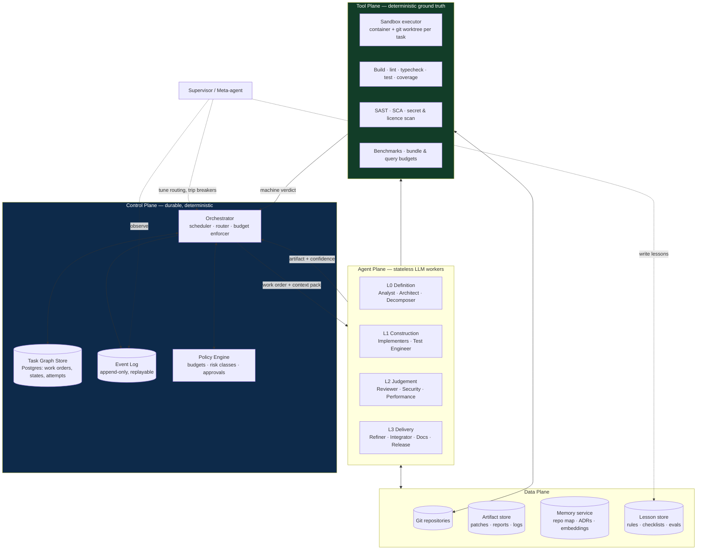
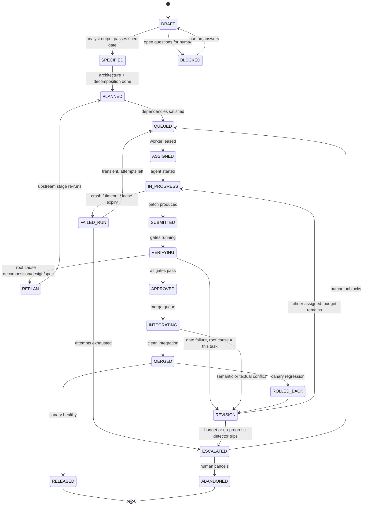
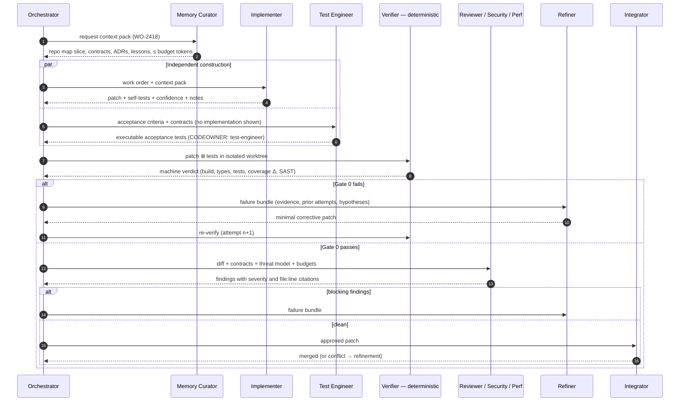

# 01 — Architecture

## 1.1 Topology

The system is a **hierarchical orchestrator over a shared task graph** (a blackboard),
not a free-form agent chat. Agents never talk to each other directly; they read and write
typed artifacts in a durable store and are dispatched by a control plane. This is what
makes the system debuggable, replayable, and horizontally scalable.



### Why these four planes

| Plane | Property it guarantees | Consequence if merged with another |
|---|---|---|
| Control | Determinism, durability, replay | Agents that schedule themselves cannot be rate-limited, budgeted, or resumed after a crash |
| Agent | Statelessness, interchangeability | Stateful agents cannot be scaled out, retried, or swapped for a cheaper model |
| Tool | Objective truth | An LLM that judges its own build output will hallucinate a green build |
| Data | Shared, versioned context | Context living in conversation history is unbounded, lossy, and non-reproducible |

## 1.2 The work order — unit of scheduling

Everything the system does is a **work order**: a self-contained, independently
verifiable unit with its own acceptance criteria. Work orders are sized so a single agent
run can complete one within its context and token budget — the Decomposer enforces this.

```json
{
  "id": "WO-2418",
  "parent": "EPIC-31",
  "type": "implement",
  "title": "Add idempotency key to POST /payments",
  "risk_class": "high",
  "depends_on": ["WO-2411", "WO-2412"],
  "capabilities_required": ["backend", "postgres", "payments-domain"],
  "contracts": ["openapi://payments/v2#/paths/~1payments/post"],
  "acceptance_criteria": [
    "GIVEN a repeated request with the same Idempotency-Key WHEN POST /payments is called THEN the original response is returned and no second charge is created"
  ],
  "files_hint": ["src/payments/**", "migrations/**"],
  "budget": { "tokens": 400000, "usd": 6.0, "wall_clock_s": 900, "max_attempts": 3 },
  "state": "QUEUED",
  "attempts": 0
}
```

Full schema: [`schemas/work-order.schema.json`](../schemas/work-order.schema.json).

Three fields carry most of the system's intelligence:

- **`acceptance_criteria`** — written by the Analyst, compiled into executable tests by
  the Test Engineer, and the *only* definition of "done". They travel with the work order
  so no agent has to guess intent.
- **`risk_class`** — set by the Architect, consumed by the Policy Engine. It decides model
  tier, whether human approval is required, and how aggressive rollout may be.
- **`budget`** — hard ceilings. When exhausted, the work order escalates rather than
  continuing to spend.

## 1.3 Task state machine

Every work order moves through one state machine. The Orchestrator is the only writer;
transitions are recorded in the event log, which makes the entire run replayable.



**Invariants enforced by the Orchestrator:**

1. A work order in `QUEUED` has all `depends_on` in `MERGED` or `RELEASED`.
2. `attempts` increments on every entry to `IN_PROGRESS`; entering with
   `attempts >= max_attempts` is impossible — the transition goes to `ESCALATED`.
3. `APPROVED` requires a signed verdict from every gate applicable to the risk class.
4. Only one work order per module-lease may be in `INTEGRATING` at a time.
5. Every transition writes an event; the task graph is a projection of the event log and
   can be rebuilt from it.

## 1.4 End-to-end sequence for a single work order



Note step 5–6: the Test Engineer works **from the acceptance criteria only** and is not
shown the implementation. Tests written against an implementation validate the
implementation; tests written against the spec validate the requirement. This is the
structural reason the system can trust its own green builds.

## 1.5 Context packing

Agents do not receive "the repository". The Memory Curator assembles a **context pack**
sized to a per-agent token budget, deterministically ordered so that prompt caching hits:

| Segment | Source | Cache behaviour |
|---|---|---|
| Agent system prompt + rubric | Static, versioned | Cached prefix, changes only on prompt release |
| Repo map (module tree, public signatures) | Regenerated on merge | Cached until next merge |
| Interface contracts for touched modules | Architect artifacts | Cached per epic |
| Relevant lessons for this agent role | Lesson store, top-k | Cached per lesson-store version |
| Retrieved code slices (top-k by hybrid search) | Embeddings + symbol index | Per-task |
| Work order + acceptance criteria | Task store | Per-task |
| Failure bundle (refinement runs only) | Prior attempts | Per-attempt |

Ordering matters: everything stable goes first so the cacheable prefix is as long as
possible. In steady state this is the difference between paying full price for a 200k-token
context on every attempt and paying full price once.

## 1.6 What is deliberately *not* an agent

A recurring failure mode in multi-agent designs is modelling deterministic work as an
agent. In this design the following are plain code, and must stay that way:

- **Scheduling and routing** — a rules table plus a topological ready-check. An LLM is
  consulted only for the residual ambiguous cases (§3.2).
- **Gate 0 verification** — the build/test/scan pipeline. It returns a signed verdict.
- **Merge mechanics** — rebase, conflict detection, merge queue serialisation.
- **Budget accounting, retries, backoff, leases** — durable workflow engine primitives.
- **Metrics and alerting** — standard observability, not a "monitoring agent".

The Supervisor meta-agent observes these systems and proposes changes; it does not perform
their work.
