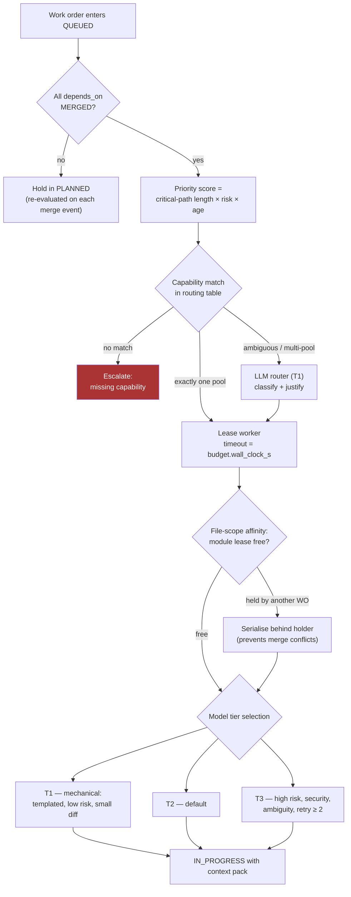
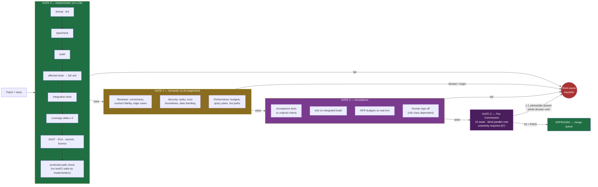
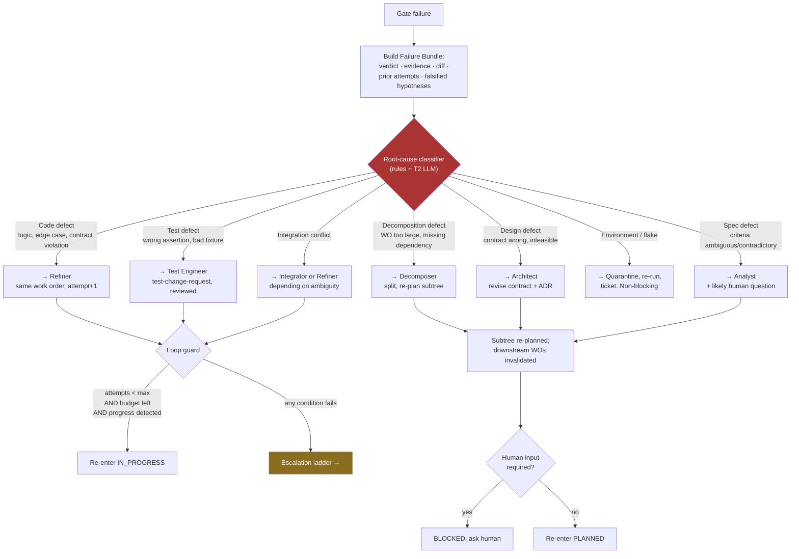

# 03 — Routing, Validation, and Feedback Loops

## 3.1 Routing overview

Routing answers three questions in order, and only the third may involve an LLM:

1. **Is it ready?** — deterministic topological check against `depends_on`.
2. **Who can do it?** — deterministic capability match against the worker pool.
3. **Which of several eligible paths?** — rules first; LLM router only for the residue.

### Routing table (deterministic first pass)

| Work-order type | Signals | Pool | Default tier |
|---|---|---|---|
| `implement` | paths `src/api/**`, `src/services/**` | Backend | T2 |
| `implement` | paths `src/ui/**`, `*.tsx`, styling | Frontend | T2 |
| `implement` | paths `migrations/**`, schema changes | Data | T3 |
| `implement` | paths `infra/**`, `*.tf`, CI config | Infra | T3 |
| `implement` | templated CRUD, codegen, mechanical refactor | Any matching | T1 |
| `test` | any | Test Engineer | T2 |
| `fix` | attempt 1 | Refiner | T2 |
| `fix` | attempt ≥ 2 | Refiner | T3 |
| `review` | risk `low`/`medium` | Reviewer | T2 |
| `review` | touches auth/payments/PII/crypto | Reviewer + Security | T3 + human |
| `adjudicate` | any reaching Gate C | Commission (seated bench, parallel) | T2/T3 by seat |
| `integrate` | any | Integrator | T2 |
| `document` | any | Docs | T1 |

**Why rules before LLM.** Routing is executed on every state change of every work order —
it is the hottest path in the system. A deterministic table is free, reproducible, and
auditable; an LLM call here multiplies cost by traffic and introduces non-determinism into
scheduling. The LLM router handles only genuinely ambiguous cases (typically < 5% of
routing decisions) and must return a justification that is logged.

### Scheduling policy

- **Priority** = `critical_path_length × risk_weight × age_factor`. Work that unblocks the
  most downstream nodes runs first.
- **WIP limits** per pool prevent context-window thrash, rate-limit exhaustion, and a
  merge queue that grows faster than it drains.
- **Leases** with timeouts: a crashed worker's work order returns to `QUEUED` automatically
  when its lease expires — this is why workers must be stateless and idempotent.
- **Module affinity**: work orders touching the same files are serialised, not
  parallelised. Parallelising them trades a scheduling delay for a merge conflict, which is
  strictly worse.
- **Starvation guard**: `age_factor` grows over time so low-priority work eventually runs.

## 3.2 Validation: three gates

Validation is layered cheapest-and-most-objective first. Each gate's output is a signed
verdict stored against the work order.

### Gate design rules

| Rule | Rationale |
|---|---|
| Gate 0 runs before any LLM gate | Never spend a review call on code that does not compile |
| Gate 0 is fail-fast and cheapest-first | Median failure is caught in seconds, not minutes |
| A gate may only block on its own domain | The Reviewer restating "add tests" after coverage passed is noise that stalls loops |
| Blocking findings need reproducible evidence | Prevents unfalsifiable objections from creating infinite loops |
| Verdicts are immutable and signed | Re-verification after rebase is mandatory; stale verdicts never merge |
| Gate strictness scales with `risk_class` | A copy change and a payments change should not cost the same |

### Gate applicability by risk class

| Check | Low | Medium | High |
|---|---|---|---|
| Gate 0 full suite | ✅ | ✅ | ✅ |
| Reviewer | T1 | T2 | T3 |
| Security agent | on security-path diffs | ✅ | ✅ + human |
| Performance agent | on hot-path diffs | ✅ | ✅ + benchmarks |
| Human approval | ❌ | on escalation | ✅ mandatory |
| Commission bench | reduced (C1,C2,C3,C8,C10) | full 10 | full 10 |
| Canary window | 15 min | 1 hour | 24 hours + staged flags |

Bench composition governs which seats are *seated* for a risk class. It never softens the
decision rule: a dissent from any seated commissioner voids the entire adjudication. Full
bench is the default until per-seat precision has been measured and is stable (§7.12).

## 3.3 The feedback loop: root-cause routing

The central idea: **a failure is routed to the stage that caused it, not always back to the
coder.** Most agent pipelines send every failure back to the implementer, which is why they
loop — an implementer cannot fix an ambiguous requirement or an oversized work order, so it
churns until the budget dies.

### Root-cause classification signals

The classifier is rules-first, LLM-assisted. Strong deterministic signals:

| Signal | Implied root cause |
|---|---|
| Same test fails identically across ≥ 2 different agents | Spec or design defect, not code |
| Failure is a contract-schema violation | Design defect if the contract is wrong; code defect if the patch deviates |
| Diff touches > N files or exceeds size budget repeatedly | Decomposition defect — work order too large |
| Test passes locally, fails in CI, non-reproducible | Environment/flake |
| Acceptance criteria contradict each other | Spec defect |
| Two work orders' tests pass alone but fail together | Integration/semantic conflict |
| Reviewer blocker cites a criterion the WO never covered | Decomposition defect (coverage gap) |
| C1 or C10 dissent (requirements unmet, evidence missing) | Spec or decomposition defect — never routed to the coder |
| C3 dissent (workaround, not a fix) | Code defect, routed to the Refiner with the dissent as an added acceptance criterion |
| C4 dissent (wrong skills or method) | Method defect — re-run with corrected tooling; recurring instances are a lesson, not a patch |

### The no-progress detector

The loop guard trips on **any** of these, before the attempt ceiling is reached:

1. **Identical failure signature** — the same test fails with the same assertion message
   two attempts in a row.
2. **Diff oscillation** — attempt *n* diff is ≥ 90% similar to attempt *n−2* (the agent is
   cycling between two wrong answers).
3. **Monotonic diff growth** — the patch grows every attempt without reducing the failure
   count (the agent is guessing, not diagnosing).
4. **Failure-count plateau** — failing checks unchanged across two attempts.
5. **Budget burn rate** — > 60% of token budget spent with < 30% of failures resolved.

Tripping the detector escalates **immediately**. Detecting non-convergence early is worth
more than any additional retry: the third identical attempt has never, in practice, been
the one that works.

### Loop budgets (defaults)

| Scope | Limit | On exhaustion |
|---|---|---|
| Attempts per work order at one gate | 3 | Escalation ladder |
| Commission adjudication rounds | 3 | Human arbitration with full dissent ledger |
| Total attempts per work order | 6 | Human escalation |
| Re-plans per subtree | 2 | Human escalation |
| Spec revisions per epic | 3 | Human product review |
| Token budget per work order | as assigned | Hard stop, escalate |
| Wall-clock per work order | as assigned | Lease expiry, requeue once, then escalate |

## 3.4 Convergence properties

The loop terminates because every cycle strictly decreases at least one bounded quantity:
attempts remaining, tokens remaining, or wall-clock remaining — and the no-progress
detector shortcuts cycles that decrease nothing else. Re-plan cycles are separately bounded
so a spec ↔ design ↔ decomposition ping-pong cannot recur indefinitely. There is no path
through the state machine that returns to the same state with all budgets unchanged.
