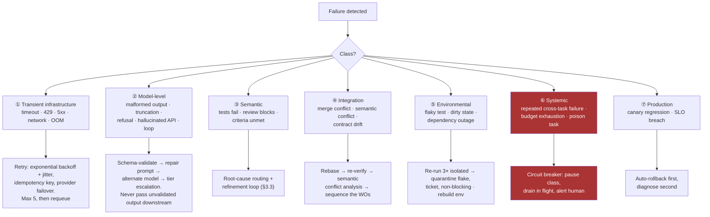
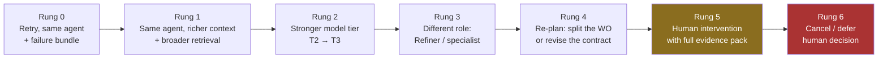

# 04 — Failure Handling

Failure is the normal case, not the exception. A system that only works when agents
succeed is a demo. This section defines what can fail, what happens automatically, and
when a human is pulled in.

## 4.1 Failure taxonomy

## 4.2 Handling by class

### ① Transient infrastructure

Standard distributed-systems hygiene, applied to model calls as well as tools.

- Exponential backoff with full jitter: `min(cap, base × 2^n) × random(0.5, 1.0)`.
- **Idempotency keys on every side-effecting operation** — a retried agent run must not
  create a second branch, second PR, or second deployment. This is the most commonly
  missed requirement in agent systems: the retry is easy, the deduplication is not.
- Provider failover for model calls (secondary provider or region) with a pinned
  equivalent model version.
- Lease expiry returns the work order to `QUEUED`; the worktree is destroyed and recreated
  from the pinned base commit, never resumed dirty.
- Retries are capped and counted separately from *semantic* attempts — infrastructure
  flakiness must not consume the refinement budget.

### ② Model-level

| Symptom | Handling |
|---|---|
| Output fails schema validation | One repair prompt with the validation error; then fall back to a stronger model; then escalate. Never coerce or "best-effort parse" a malformed artifact into the pipeline. |
| Truncated output (hit max tokens) | Detect via finish reason, not by inspecting content. Re-run with a reduced context pack or split the work order. |
| Refusal / empty response | Log verbatim, retry once with clarified framing, then escalate to human. Never silently swallow. |
| Hallucinated API or dependency | Caught deterministically at Gate 0 (typecheck/build). This is why Gate 0 precedes every LLM gate. |
| Agent loops within a single run | Per-run step cap and tool-call cap; exceeded ⇒ terminate the run, keep the transcript in the failure bundle. |
| Contradicts a frozen contract | Rejected at Gate 0 contract check; reported as `contract_deviation`, routed to the Architect if the contract is genuinely wrong. |

**Rule: every agent output is schema-validated at the boundary.** An unvalidated artifact
entering the task store corrupts every downstream decision, and the corruption surfaces far
from its cause.

### ③ Semantic

Handled by the root-cause routing and refinement loop in §3.3, under the attempt, budget,
and no-progress ceilings defined there.

### ④ Integration

- **Textual conflicts**: rebase, then resolve only if both sides' intent is unambiguous;
  otherwise return a refinement work order to the author of the losing side.
- **Semantic conflicts** (both merge cleanly, both suites pass, combined behaviour wrong):
  detected by running the full suite plus cross-module contract tests on the *combined*
  result, which is why the merge queue is serialised and re-verifies after rebase.
- **Contract drift**: a merged change to a frozen contract invalidates every in-flight work
  order built against it. The Orchestrator marks affected work orders for re-verification
  rather than letting them merge against a contract that no longer exists.
- Prevention beats resolution: file-scope affinity and module leases (§3.1) mean most
  conflicts never occur.

### ⑤ Environmental

- Flaky test protocol: re-run 3× in isolation. Consistent failure ⇒ real. Inconsistent ⇒
  quarantine, open a ticket, exclude from blocking, and report to the Supervisor.
- Flake budget: if quarantined tests exceed a threshold (e.g. 2% of the suite), a
  Supervisor breaker trips — a suite nobody trusts is worse than no suite.
- Dirty state: every run gets a fresh container and worktree from a pinned base. Runs are
  never resumed in place.
- Third-party outage: circuit-break the affected capability, park dependent work orders,
  continue with the rest of the DAG.

### ⑥ Systemic

The dangerous class: many small failures that are individually retryable but collectively
mean the system is broken.

| Detector | Threshold (tunable) | Action |
|---|---|---|
| Same agent role failing across unrelated work orders | > 40% failure rate over 20 runs | Trip breaker on that role; alert; likely prompt/model regression |
| Poison work order | ≥ K failures across ≥ 2 different agents | Quarantine, human triage — do not keep spending |
| Cost anomaly | epic burn > 150% of estimate | Pause epic, human review |
| Merge queue growth | depth increasing for > 30 min | Reduce implementer WIP; investigate main-line health |
| Main line red | any | **Global halt on merges**; all capacity to the fix |
| Escalation rate | > 20% of work orders | Decomposition or spec quality problem; stop and re-plan |
| Commission rejection rate | > 40% of dossiers rejected round 1 | Either upstream quality collapsed or a seat has drifted; check per-seat *q* before touching the pipeline (§7.12) |
| Commission seat drift | dissent precision < 0.7, or generation delta ≤ 0 sustained | Trip breaker on the seat, revert to the prior generation's Precedent Pack, human review (§7.11) |

**Circuit breakers** follow closed → open → half-open. Opening a breaker drains in-flight
work rather than killing it, parks new work, and alerts. Only a human closes a breaker that
opened on a systemic detector — automatic recovery from a systemic fault usually means
resuming a broken system at full speed.

**Dead-letter queue**: work orders that exhaust every path land in a DLQ with the full
event trail, all attempts, and the failure bundle. The DLQ is a first-class human work
queue, reviewed on a schedule — not a graveyard.

### ⑦ Production

- Canary breach ⇒ **automatic rollback first**, diagnosis second. Rollback is a flag flip
  or a revert of a single merge commit, which is why every change ships behind a flag and
  merges atomically.
- Rollback creates a high-priority work order carrying the incident evidence, routed to the
  Refiner with the Security agent attached if the regression was security-relevant.
- Migrations use expand/contract so a rollback never leaves the schema ahead of the code in
  an unrecoverable way. Destructive steps are separate, human-approved work orders.
- A production incident always produces a lesson and, where possible, a regression test
  added to the acceptance suite before the fix merges.

## 4.3 Escalation ladder

When the refinement loop cannot converge, escalation proceeds up fixed rungs. Each rung
changes *something structural* — never simply "try again".

Rules:

1. **A rung may not repeat.** Repeating a rung is the definition of a loop.
2. **Skip rungs on strong signal.** Identical failures across two different agents skip
   straight to Rung 4 — the problem is upstream, not in the code.
3. **Every escalation carries the full evidence pack**: all attempts, all hypotheses tried
   and falsified, all verdicts. A human receiving "it failed 6 times" cannot act; a human
   receiving "three agents each concluded the contract requires an idempotency store that
   the design does not specify" can act in a minute.
4. **Escalation is not failure.** Escalation rate is a first-class metric: near-zero means
   budgets are too loose and the system is burning tokens on hopeless work; too high means
   specs or decomposition are inadequate.

## 4.4 Guarantees under failure

| Property | Mechanism |
|---|---|
| **No lost work** | Every state change is an event-log entry; the task graph is a replayable projection |
| **No duplicate side effects** | Idempotency keys on branch creation, PR creation, merges, deploys |
| **No partial merges** | Merge queue is serialised; a merge either lands green or is reverted atomically |
| **No silent corruption** | Every agent output is schema-validated at the boundary before entering the store |
| **No unbounded spend** | Per-work-order, per-epic, and global budget ceilings with hard stops |
| **No infinite loops** | Attempt ceilings + no-progress detector + non-repeating escalation ladder |
| **Recoverable from crash** | Workers stateless; leases expire; worktrees rebuilt from pinned commits |
| **Auditable** | Every decision — including LLM routing choices — is logged with its justification and the artifact hashes it saw |
| **No unilateral acceptance** | Final approval requires unanimous consent from every seated commissioner against a sealed dossier; one dissent voids the whole adjudication (§7.5) |
| **No standard drift across generations** | Commission succession is validated by bench exam against sealed ground truth, not against the predecessor's account of it (§7.10) |
