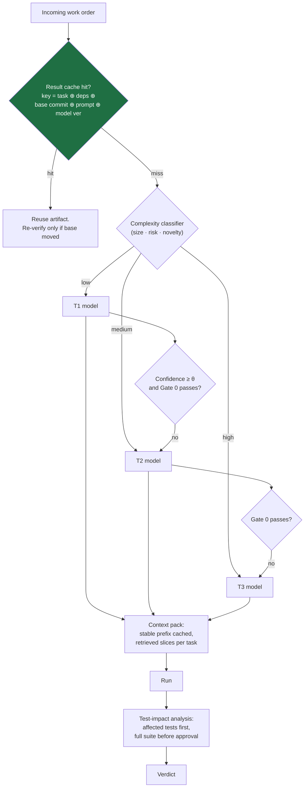
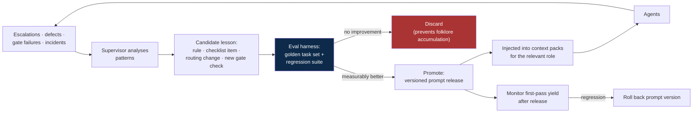
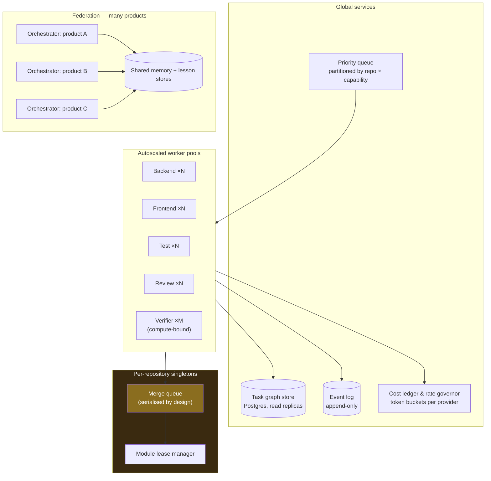

# 05 — Optimization and Scalability

## 5.1 What we optimise

Three quantities trade against each other. Optimising one blindly wrecks the others, so the
system optimises a constrained objective: **minimise cost and cycle time subject to a floor
on escaped-defect rate.** Quality is a constraint, not a term to be traded away.

| Metric | Definition | Target direction |
|---|---|---|
| First-pass gate yield | % of patches passing Gate 0 on attempt 1 | ↑ |
| Rework ratio | attempts per merged work order | ↓ |
| Cost per merged work order | tokens + compute ÷ merges | ↓ |
| Cycle time | request → released, p50 and p90 | ↓ |
| **Escaped defect rate** | production defects ÷ merged work orders | **floor — never traded** |
| Human touches per work order | interventions ÷ merges | ↓ |
| Escalation rate | escalated ÷ total | 5–15% band |
| Commission first-round acceptance | dossiers accepted 10/10 on round 1 | ↑ — falling means either quality regression or seat drift (§7.11) |
| Repeat-defect rate | same defect class recurring after a lesson shipped | ↓ to zero — the honest test of whether the fleet remembers (§9.10) |

## 5.2 Cost optimisation

Fleet-wide output discipline, per-role token budgets, reasoning-depth assignment, and the
instance-replacement protocol are specified in
[`10-token-efficiency.md`](10-token-efficiency.md). This section covers the architectural
levers; that one covers the settings.

### The levers, in order of impact

1. **Prompt caching on a stable prefix.** Context packs are ordered stable-to-volatile
   (§1.5) so the system prompt, repo map, contracts, and lessons form a long cacheable
   prefix that is reused across every attempt and every agent in an epic. In refinement
   loops — where the same context is re-sent 3–6 times — this is the single largest saving
   available.
2. **Model cascade.** Start cheap, escalate on failure or low confidence. Most work orders
   are mechanical; paying T3 prices for templated CRUD is the most common waste in these
   systems. Crucially, the cascade is safe here *because* Gate 0 is deterministic — a cheap
   model's mistakes are caught, not shipped.
3. **Retrieval instead of whole-repo context.** Cost is superlinear in context length and
   accuracy degrades in long contexts. Top-k retrieval with symbol-graph expansion
   outperforms "give the model everything" on both axes. The same logic governs procedural
   knowledge: skills load by progressive disclosure — description resident, body on
   activation, references on demand — so an agent can carry dozens of procedures for the
   cost of a few hundred tokens (§8.1).
4. **Result and verification caching.** Key on `(work order hash, dependency hashes, base
   commit, prompt version, model version)`. Build caches, test-impact analysis, and
   incremental typechecking mean a rebase does not re-run 40 minutes of CI.
5. **Early termination.** Kill runs exceeding token or wall-clock budget at the moment of
   breach, not at the end. Combined with the no-progress detector (§3.3), this cuts the
   long tail of doomed attempts that dominate cost distributions.
6. **Batching.** Group small independent items (doc updates, nit-level review comments,
   lint fixes) into single calls.
7. **Selective self-consistency.** N-candidate generation with a judge is expensive; apply
   it only where a wrong answer is costly and hard to reverse — architecture decisions,
   migration plans, security-sensitive logic — never to routine implementation.

### Latency optimisation

- **Parallel DAG execution** is the main lever: width, not speed per node.
- **Speculative execution** on the critical path only: start the highest-probability
  downstream work order against a not-yet-merged contract, and discard if it changes.
  Bounded by a speculation budget — this trades tokens for wall-clock and must be capped.
- **Fail-fast gate ordering**: median failure detected in seconds.
- **Streaming hand-off**: begin Gate 0 lint/typecheck on the partial diff as the agent
  writes, rather than waiting for the full artifact.
- **Warm sandboxes**: pre-provisioned containers with dependencies installed; cold-start
  container provisioning frequently exceeds model latency.

## 5.3 Quality optimisation — the learning loop

Non-negotiable properties of this loop:

- **Prompts are versioned artifacts** with releases and rollbacks, treated exactly like
  code. An unversioned prompt library cannot be debugged when quality drops.
- **Lessons must earn their place.** Every promoted lesson consumes context budget forever.
  Requiring a measured improvement on the golden set is what stops the prompt library
  degenerating into a pile of contradictory advice that crowds out the actual task.
- **Golden task set** — a curated set of representative work orders with known-good
  outcomes, re-run on every prompt or model change.
- **Model upgrades are evaluated, not assumed.** Run the golden set on the new model,
  compare yield and cost, then re-tier.

## 5.4 Scalability

### Scaling model

### Scaling dimensions

| Dimension | Approach | Hard limit |
|---|---|---|
| More work orders | Add stateless workers; autoscale on queue depth per capability | Provider rate limits, merge queue throughput |
| Bigger codebase | Sharded retrieval indexes, module-scoped repo maps, per-module contracts | Retrieval quality, not compute |
| More repos/teams | One Orchestrator per product line; shared memory and lesson stores | Cross-repo contract coordination |
| Longer projects | Epic summarisation and compaction so context stays bounded as history grows | — |
| Higher concurrency | File-scope affinity + module leases to keep conflicts near zero | Serialised merge queue |

### The real bottleneck: integration, not generation

Agent capacity scales trivially — add workers. **The merge queue does not**, because it is
serialised by necessity (each merge must be verified against the actual resulting main
line). Consequences that shape the design:

- Maximise **DAG width with disjoint file scopes** so parallel work orders rarely contend.
- **Batch-verify** compatible merges: speculatively test batches of N approved patches
  together, bisect on failure. This is how large monorepos sustain high merge throughput.
- **Shard the merge queue by module** where the module boundary is genuinely independent —
  which is exactly what the Architect's contracts define.
- Watch queue depth as the primary saturation signal: if it grows, adding implementer
  workers makes throughput *worse*, not better. Reduce WIP instead.

### Rate limits and backpressure

- Token-bucket governor per provider and per model tier, with priority classes: production
  incidents > critical path > normal > speculative.
- Backpressure propagates to the queue rather than failing runs — WIP limits fall as
  capacity tightens.
- Provider diversity for failover, with pinned equivalent versions per tier.
- Speculative work is the first thing shed under pressure.

### Isolation and multi-tenancy

- One container + git worktree per run; no shared mutable state between agents.
- Resource quotas (CPU, memory, disk, wall-clock) per run.
- Network egress allowlist — package mirrors and approved APIs only. An agent with open
  egress and repository credentials is an exfiltration path.
- Least-privilege credentials scoped per work order; no long-lived production credentials
  in agent contexts.
- Per-tenant budget ceilings so one runaway epic cannot starve the fleet.

## 5.5 Capacity planning heuristics

Starting points for sizing, to be replaced with measured values:

| Quantity | Planning heuristic |
|---|---|
| Verifier workers | ≈ 1.5 × implementer workers (verification runs on every attempt, plus re-verification after rebase) |
| Review capacity | ≈ 1 × implementer first-pass yield (only passing patches reach Gate C) |
| Merge queue throughput | `3600 ÷ (rebase + full verify seconds)` merges/hour — measure and treat as the fleet's true ceiling |
| Implementer WIP | Set so queue depth stays flat; increase only when merge throughput has headroom |
| Token budget per work order | p90 of measured historical usage for its type × 1.5 |
| Speculation budget | ≤ 10% of total tokens |

The design rule that follows from the table: **size the fleet from the merge queue
backwards.** Implementer capacity beyond what integration can absorb converts directly into
conflicts, stale verdicts, and rework.
