# 06 — Implementation Guide

## 6.1 Reference stack

Concrete choices that satisfy the architectural requirements. Substitutions are fine as
long as the property in the right-hand column survives.

| Concern | Reference choice | Property that must hold |
|---|---|---|
| Durable orchestration | Temporal / AWS Step Functions | Survives process crashes; resumable; built-in retries, timeouts, and idempotency |
| Task graph store | Postgres | Transactional state transitions; queryable DAG |
| Event log | Postgres append-only table or Kafka | Immutable, replayable, ordered |
| Queue | SQS / Redis Streams / Postgres `SKIP LOCKED` | At-least-once with visibility timeouts (leases) |
| Sandbox | Firecracker / gVisor / Docker + git worktree | Hermetic, disposable, resource-capped, egress-controlled |
| Agent runtime | Claude Agent SDK, or direct Messages API with a tool loop | Structured tool use, schema-validated outputs, prompt caching |
| Models | Claude Opus 5 (T3), Claude Sonnet 5 (T2), Claude Haiku 4.5 (T1) | Pinned versions; a documented equivalent per tier for failover |
| Retrieval | pgvector / Qdrant + BM25 + tree-sitter symbol index | Hybrid search; symbol-graph expansion |
| Artifact store | S3 + Git | Content-addressed, hashed, immutable |
| CI / Gate 0 | GitHub Actions / Buildkite | Pinned toolchain, reproducible, signed verdicts |
| Merge queue | GitHub merge queue / Zuul | Serialised, rebase-and-verify before merge |
| Feature flags | LaunchDarkly / OpenFeature | Runtime kill switch independent of deploy |
| Observability | OpenTelemetry → Grafana/Datadog | Trace spanning the full work-order lifecycle |
| Prompt registry | Git + versioned releases | Prompts are versioned artifacts with rollback |

**Model pinning is not optional.** A silently changing model version turns every quality
metric into noise and makes regressions undebuggable. Pin exact versions per tier and
migrate deliberately via the golden-set evaluation in §5.3.

## 6.2 Phased rollout

Do not build all seventeen agents first. Each phase must be delivering value and producing
metrics before the next begins — the metrics from phase *n* are what tell you how to
configure phase *n+1*.

```mermaid
flowchart LR
    P1["Phase 1 — Skeleton<br/>Implementer + Gate 0 + human review<br/>2–4 weeks"] --> P2
    P2["Phase 2 — Separation of duties<br/>+ Test Engineer, + Reviewer,<br/>protected test paths"] --> P3
    P3["Phase 3 — Planning layer<br/>+ Analyst, Architect, Decomposer<br/>(parallel DAG execution begins)"] --> P4
    P4["Phase 4 — Loops<br/>+ Refiner, root-cause classifier,<br/>escalation ladder, budgets"] --> P5
    P5["Phase 5 — Delivery<br/>+ Integrator, merge queue,<br/>Release agent, flags, canary"] --> P6
    P6["Phase 6 — Scale &amp; learn<br/>+ Supervisor, lesson store,<br/>eval harness, model cascade"] --> P7
    P7["Phase 7 — Commission<br/>+ 10 seats, unanimity, dissent ledger,<br/>tenure &amp; succession, precedent corpus"]

    style P1 fill:#0d2a4a,color:#fff
    style P7 fill:#4a1d5c,color:#fff
```



| Phase | Ship criterion before moving on |
|---|---|
| 1 | Gate 0 is reproducible and trusted; humans review every merge |
| 2 | Implementers structurally cannot edit acceptance tests; first-pass yield measured |
| 3 | Work orders sized so > 80% complete within budget on attempt 1–2 |
| 4 | Escalation rate lands in the 5–15% band; no loop exceeds its budget |
| 5 | Rollback exercised in production at least once, deliberately |
| 6 | A prompt change has been promoted *and* rolled back via the eval harness |
| 7 | Per-seat false-dissent rate *q* measured below 0.01, and at least one full succession cycle (pack → bench exam → seating) completed |

Phase 2 is the one teams skip and later regret. Until the implementer is mechanically
prevented from editing acceptance tests, green results carry no information.

The Commission comes **last** for a reason. It is a quality amplifier, not a quality
substitute: ten unanimous judges in front of a pipeline whose deterministic gates are
untrusted or whose work orders are badly sized will reject nearly everything, and the
rejections will be correct. Standing it up before phase 6 produces a Commission that spends
its tenure re-discovering that the upstream stages are broken — at ten LLM calls per
discovery. Build the gates first, then add the body that judges what survives them.

## 6.3 Instrumentation

Every work order carries one trace from intake to release. Minimum spans and attributes:

```
trace: work_order_id
├── span: context_pack        attrs: tokens, cache_hit_ratio, retrieved_files, dropped
├── span: agent_run           attrs: role, model, tier, attempt, tokens_in/out, cost, confidence
├── span: gate0               attrs: check, duration, verdict, failing_tests[], coverage_delta
├── span: gate1               attrs: findings_by_severity, blocking, agent_role
├── span: gate2               attrs: acceptance_pass, human_wait_ms
├── span: refinement          attrs: attempt, root_cause_class, progress_detected, escalation_rung
├── span: gateC_adjudication  attrs: round, bench, dossier_hash, votes, admissible_dissents,
│                                    void_dissents, contradiction, seat_generations
└── span: integration         attrs: rebase_conflicts, queue_wait_ms, semantic_conflict
```

Dashboards that matter, in priority order:

1. **First-pass yield by agent role and model tier** — the earliest signal of a prompt or
   model regression.
2. **Merge queue depth and throughput** — the fleet's true capacity ceiling (§5.5).
3. **Cost per merged work order, by work-order type** — where the money actually goes.
4. **Escalation rate and rung distribution** — a shift toward Rung 4+ means upstream
   (spec/design/decomposition) quality is degrading, not coding quality.
5. **Escaped defect rate** — the constraint that may never be traded for speed.
6. **Human touches per work order** — the honest measure of autonomy.
7. **Commission health** — per-seat false-dissent rate *q*, dissent precision, and
   first-round acceptance `(1 − q)^10`. A rising *q* silently strangles throughput before
   it shows up anywhere else, because every rejection looks individually justified.

## 6.4 Anti-patterns

Failure modes that recur in multi-agent development systems, and the design element that
prevents each.

| Anti-pattern | Why it fails | Prevented by |
|---|---|---|
| Agents chatting freely to converge | Unbounded cost, no audit trail, no reproducibility, drifts off-task | Blackboard + typed artifacts (§1.1) |
| LLM as scheduler/router | Non-deterministic, unauditable, expensive on the hottest path | Deterministic Orchestrator (§2.1, §3.1) |
| Coder writes and owns its own acceptance tests | Green suites that assert nothing | Separation of duties + protected paths (§2.5, §2.6) |
| Reviewer agent restating linter output | Burns tokens, stalls loops, trains humans to ignore findings | Gate ordering + domain restriction (§3.2) |
| Unbounded retry ("just try again") | Cost blowout with zero convergence | Attempt ceilings + no-progress detector (§3.3) |
| Sending every failure back to the coder | Coders cannot fix specs or oversized tasks | Root-cause routing (§3.3) |
| Whole repo in context | Superlinear cost, degraded accuracy | Retrieval + context packs (§1.5) |
| Trusting a verdict from a stale base | Green PR, red main | Rebase-and-re-verify in merge queue (§2.12) |
| Skipping the flake protocol | Nobody trusts the suite; real failures get overridden | Quarantine + flake budget (§4.2⑤) |
| Prompts edited ad hoc in production | Unattributable quality regressions | Versioned prompt registry + eval gate (§5.3) |
| Accumulating unvalidated "lessons" | Contradictory folklore crowding out the task | Eval-gated lesson promotion (§5.3) |
| Scaling implementers to fix slowness | Integration is the bottleneck; more WIP means more conflicts | Size from merge queue backwards (§5.5) |
| Agents with open network egress and repo credentials | Exfiltration path | Egress allowlist + least-privilege scoping (§5.4) |
| Removing the human gate early | Compounding errors in irreversible places | Risk-class-driven approval (§3.2, §2.17) |
| Ten judges all asked "is this good?" | Correlated opinions, endless overlap, near-certain deadlock at ten times the cost | Disjoint jurisdictions per seat (§7.3) |
| Judges voting sequentially or seeing each other's votes | Commission collapses to its first voter — one opinion with nine echoes | Blind parallel voting (§7.4) |
| Dissent without a clearance condition | Unfalsifiable objection under a unanimity rule = permanent block | Mandatory remediation condition (§7.4) |
| Letting the remediator mark a dissent resolved | The objection is closed by the party it was raised against | Clearance only by the issuing seat or successor (§7.5) |
| Succession by paraphrase | Standards drift generation over generation with nothing detecting it | Bench exam graded against sealed ground truth (§7.10) |
| Commission with no canary dossiers | A silently lenient gate is indistinguishable from a healthy one | Planted-defect canaries (§7.13) |

## 6.5 What stays human, permanently

Autonomy is not the goal; reliable delivery is. These are not transitional training wheels:

- **Product intent and trade-offs** — what to build and what to sacrifice.
- **Irreversible decisions** — destructive migrations, data deletion, public API contracts,
  security posture changes.
- **Accepting residual risk** — someone accountable signs off on auth, payments, PII.
- **Cancelling work** — deciding that a line of work is no longer worth pursuing.

The system's job is to make sure humans spend their attention on exactly these decisions,
each arriving with a complete evidence pack, and on nothing else.

## 6.6 Minimum viable version

If you implement only one page of this design, implement this:

1. Work orders with **falsifiable acceptance criteria** and a hard budget.
2. An **Implementer** that cannot edit tests.
3. A separate **Test Engineer** compiling criteria into executable tests.
4. **Gate 0** as deterministic ground truth, fail-fast.
5. A **Refiner** with a 3-attempt ceiling, a failure bundle, and a no-progress detector.
6. **Escalation to a human** with the full evidence pack when the ceiling is hit.

That is a working, honest system. Everything else in this design makes it cheaper, faster,
and larger — but those six items are what make it *trustworthy*.
