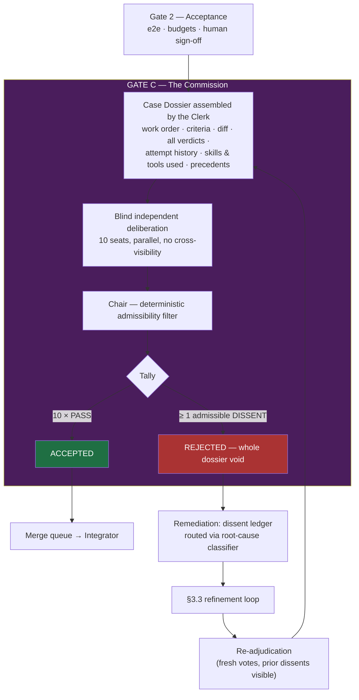
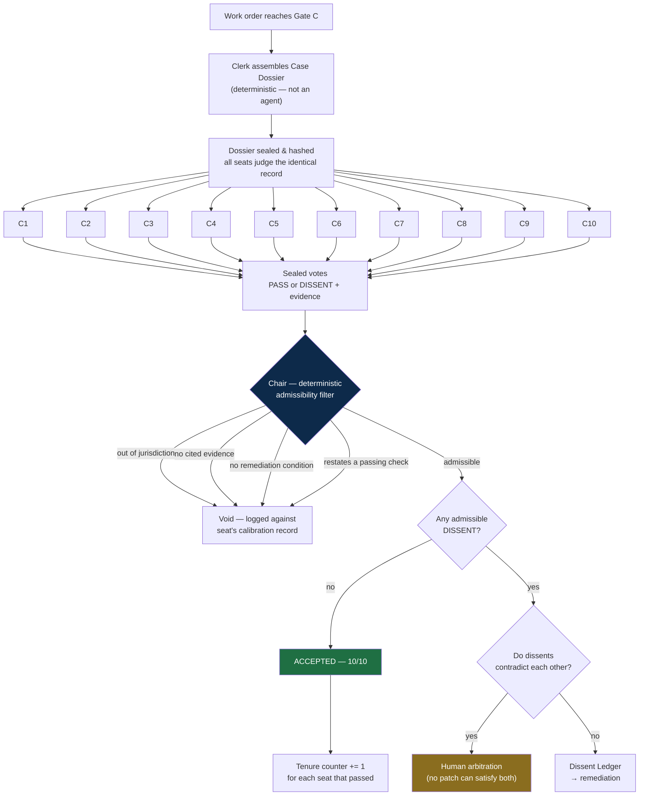
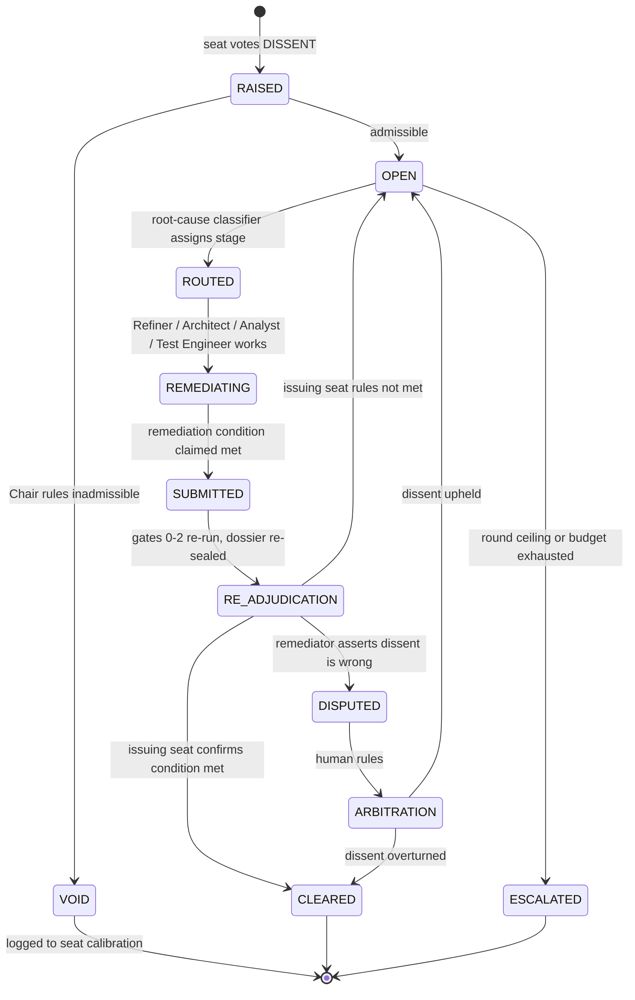
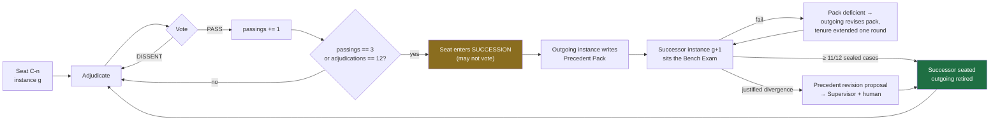
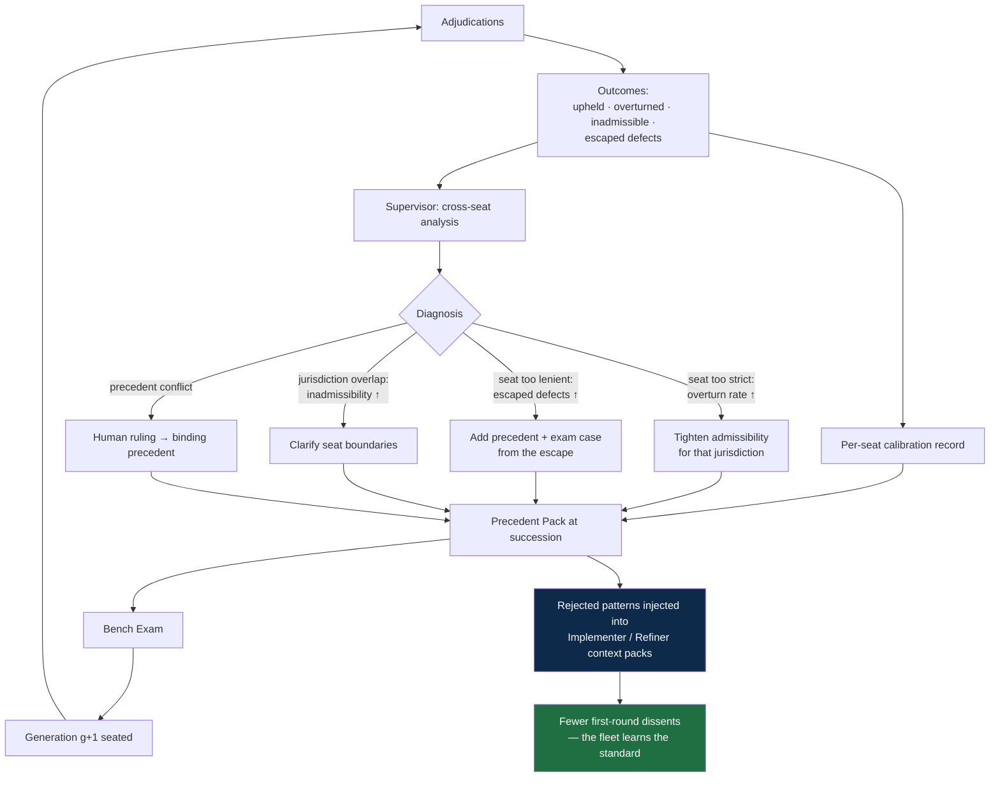

# 07 — The Commission

A ten-member adjudication body with **absolute unanimous authority** over whether work is
accepted. Any single commissioner's dissent voids the entire adjudication — nothing is
partially approved, and no downstream step proceeds — until the dissented point is fixed.
Commissioners hold a **tenure of three passings**, after which they must transmit what they
have learned to a successor instance, so the Commission's judgement compounds across
generations rather than living and dying inside one agent's context window.

The Commission is the answer to the question the rest of this design leaves open: *who
decides that something is genuinely done, rather than merely green?*

## 7.1 Authority and scope

| Property | Rule |
|---|---|
| **Position** | Gate C — final authority, after Gate 2, before the merge queue |
| **Decision rule** | Unanimity. Ten PASS votes accept; one DISSENT rejects everything |
| **Granularity** | All-or-nothing. There is no partial acceptance and no "approved except…" |
| **Clearance** | Only the seat that raised a dissent (or its successor) may clear it |
| **Powers** | Read-only. Commissioners never edit code, tests, config, or artifacts |
| **Reviewability** | A dissent may be ruled *inadmissible* by the Chair on procedural grounds, never overruled on substance by another agent |
| **Escalation** | Contradictory dissents or exhausted rounds go to human arbitration |

The four things the user of this system most wants caught map directly onto seats:
**does not work** → C2, **is not fixed** → C3, **wrong skills or method used** → C4,
**does not meet requirements or expected results** → C1 and C10.

## 7.2 Where the Commission sits



The Commission deliberately runs **after** Gates 0–2, never instead of them. Ten LLM judges
are the most expensive component in this design; spending them on work that does not
compile, or whose tests fail, is waste. Gates 0–2 establish that the work is a *plausible
candidate*; the Commission decides whether it is *acceptable*.

## 7.3 The ten seats

Jurisdictions are **disjoint by construction**. This is the single most important design
decision in the Commission: ten agents all asked "is this good?" produce ten correlated
opinions, endless overlap, and near-certain deadlock. Ten agents each asked one question
nobody else is asked produce ten independent signals — and a dissent that is attributable,
actionable, and clearable.

| # | Seat | The one question it answers | Primary evidence | Tier |
|---|---|---|---|---|
| **C1** | **Requirements** | Does this satisfy every stated acceptance criterion — the requirement, not the test of it? | ProductSpec, criteria↔test coverage map, diff | T3 |
| **C2** | **Correctness** | Does it actually work, including on inputs nobody wrote a test for? | Diff, test results, adversarial reasoning | T3 |
| **C3** | **Completion** | Is it *fixed*, or worked around? | Diff scanned for stubs, TODOs, `skip`, suppressions, dead paths, silent catches | T2 |
| **C4** | **Method & Skills** | Were the right tools, patterns, and prescribed workflow used? | Tool/skill invocation log, repo conventions, ADRs | T2 |
| **C5** | **Contract & Architecture** | Does it conform to frozen contracts and recorded decisions? | Contracts, ADRs, contract-conformance verdict | T3 |
| **C6** | **Security & Privacy** | Does it introduce risk to systems or data? | Threat model, SAST/SCA, data-classification map | T3 |
| **C7** | **Performance & Cost** | Does it stay inside NFR and infrastructure-cost budgets? | Benchmarks, query plans, budgets, baselines | T2 |
| **C8** | **Test Integrity** | Are the tests real, and was the suite weakened to get here? | Red-green evidence, coverage delta, test diffs, quarantine list | T3 |
| **C9** | **Operability** | Can this be run, observed, migrated, and rolled back in production? | Migration plan, flags, telemetry, runbook | T2 |
| **C10** | **Evidence & Process** | Is every claim in this dossier actually backed by an artifact? | The dossier itself, provenance chain, hashes | T3 |

**C10 is the meta-seat.** It does not judge the code; it judges whether the other nine were
given enough to judge it. A dossier with a missing verdict, an unattributed claim, a
verdict issued against a stale base commit, or an attempt history with gaps is dissented by
C10 regardless of how good the code is. Without this seat, the Commission can be defeated
simply by feeding it an incomplete record.

**C3 and C8 exist because they are the two failure modes agent systems produce most often**
— a workaround presented as a fix, and a green suite that was made green by weakening it.

### Seat guardrails

- A seat may only dissent **within its jurisdiction**. Out-of-jurisdiction dissents are
  ruled inadmissible by the Chair and do not block.
- A seat may not restate a passing deterministic check (no "add tests" when C8's coverage
  evidence passed).
- A seat may not propose the fix and then judge it — clearance is judgement, not authorship.
- Seats are read-only: no repo write access, no tool that mutates state.
- Seats vote **blind** (§7.4) and may not communicate with each other.

## 7.4 Adjudication protocol



### Blind, independent, simultaneous

All ten seats receive the identical sealed dossier and vote in parallel without seeing each
other's reasoning or votes. This is not a stylistic choice:

- **Sequential or visible voting collapses the Commission to its first voter.** Later seats
  anchor on earlier reasoning, and ten opinions become one opinion with nine echoes — while
  still costing ten times as much.
- Blind voting is also what makes the dissent statistics meaningful. Correlated votes cannot
  be used to measure a seat's precision, so the succession mechanism (§7.11) would have
  nothing real to learn from.
- Parallel voting means the Commission costs one round of latency, not ten.

### What makes a dissent admissible

Every dissent must carry four things. A dissent missing any of them is void — it does not
block, and it is recorded against the seat's calibration record.

1. **Jurisdiction** — the seat's own question, not another seat's.
2. **Evidence** — a citation: `file:line`, a verdict field, a dossier artifact, a precedent.
3. **A concrete failure statement** — what breaks, for whom, under what input or condition.
   Not "this could be cleaner", not "consider whether…".
4. **A remediation condition** — *"this dissent clears when X is true"*, stated so that its
   satisfaction is objectively checkable.

Requirement 4 is what makes unanimity terminate. A dissent without a clearance condition is
an unfalsifiable objection, and ten agents empowered to raise unfalsifiable objections will
never converge. With it, every dissent is effectively an additional acceptance criterion —
and criteria are things this system already knows how to satisfy and verify.

## 7.5 The unanimity rule

> **One dissent voids everything.** Not the objectionable file, not the objectionable
> commit — the entire adjudication. No part of the dossier carries forward as approved.

Consequences, stated explicitly because they are the point rather than a side effect:

- **No partial credit.** Nine passes and one dissent is identical in effect to ten dissents.
  Downstream stages see `REJECTED`, never a partial state.
- **Prior PASS votes do not persist.** After remediation, the work is adjudicated afresh by
  all ten seats. A seat that passed the previous round may dissent on the new one — the
  patch it approved no longer exists.
- **The dossier is re-sealed each round.** Judging a stale record is exactly the failure
  C10 exists to catch.
- **Only the issuing seat clears its dissent.** Neither the Refiner, nor the Orchestrator,
  nor another commissioner may mark a dissent resolved. If the issuing seat has rotated out,
  its successor inherits the open dissent through the Precedent Pack (§7.9) and rules on it.

What carries between rounds is the **Dissent Ledger**: every dissent ever raised on this
work order, its remediation condition, and its current status. Commissioners see the ledger
on re-adjudication — so a fix that resolves one dissent by violating another is caught
immediately.

**Rejection terminates the producing instance.** A rejected verdict does not send work back
to the agent that produced it; that instance is retired and a fresh one of the same role,
with the same skills, is seated carrying a distilled carry-forward pack (§10.4). The
Commission's own succession model already works this way — the knowledge is the asset, the
instance is disposable. Replacement is bounded by the same attempt ceiling and inherits the
remaining budget, and it applies only where a fresh attempt could plausibly succeed: a C1
(requirements) or C10 (evidence) dissent routes upstream instead, because a new implementer
faces the same ambiguous spec and fails the same way.

**A PASS vote carries no rationale.** A seat that agrees has nothing a downstream stage
consumes, and its agreement is fully expressed by the vote. Rationale is mandatory only on
dissent, where someone has to act on it. Across ten seats and up to three rounds this is the
single largest token saving in the design (§10.7).

## 7.6 Dissent lifecycle



Note `DISPUTED`. A remediating agent that believes a dissent is simply wrong may say so
with evidence rather than being forced to implement a mistaken instruction. Humans arbitrate,
and the outcome is recorded against the seat's calibration record — an overturned dissent is
how the Commission learns it was too strict, which matters as much as learning it was too
lenient.

**Round ceiling:** 3 adjudication rounds per work order. Exhausting them escalates to human
arbitration with the full ledger. Combined with the §3.3 budgets, this bounds the Commission
in exactly the same way the refinement loop is bounded — unanimity cannot become an
infinite loop.

## 7.7 Contradiction and deadlock

Disjoint jurisdictions minimise conflict but cannot eliminate it: C7 (performance) and C6
(security) can genuinely want opposite things, as can C2 (correctness) and C9 (operability).

The Chair detects contradiction deterministically — two open dissents whose remediation
conditions cannot both hold — and routes straight to human arbitration **without spending a
remediation attempt**. Sending an agent to satisfy two mutually exclusive conditions is the
purest form of a non-converging loop, and it is detectable before it starts.

Arbitration output is a **binding precedent**: the human's ruling on which value wins in
this class of conflict is written into both seats' Precedent Packs, so the same
contradiction is resolved by precedent next time instead of by another human.

## 7.8 Tenure and succession

Each seat is held by an agent *instance* with a fixed tenure. **After three passings, the
instance must hand its seat to a successor.** A *passing* is one adjudication round
concluded with an admissible PASS vote from that seat.



### Rules

| Rule | Value | Rationale |
|---|---|---|
| Tenure | 3 passings | As specified. Forces frequent externalisation of knowledge |
| Hard backstop | 12 adjudications regardless of outcome | A seat that only ever dissents would otherwise never rotate and would entrench indefinitely |
| Vote lock during succession | Seat cannot vote while in SUCCESSION | Prevents an outgoing instance ruling on work it will not be accountable for |
| Staggered start | Seat *i* bootstraps with `i mod 3` prior passings | Prevents all ten seats rotating simultaneously and wiping institutional memory in one round |
| Inherited dissents | Successor inherits every open dissent of its seat | Guarantees no dissent is cleared by the simple expedient of waiting for its author to rotate out |
| Retirement | Outgoing instance is destroyed after handoff | The seat's knowledge lives in the pack, not in a context window |

The staggered start matters more than it looks. With synchronised tenure, every third
adjudication would be judged by ten simultaneously inexperienced instances. Offsetting the
counters means at most three or four seats turn over together, and the rest of the bench
carries continuity.

## 7.9 The Precedent Pack

The Precedent Pack is the actual product of a commissioner's tenure. The instance is
disposable; the pack is the asset.

```json
{
  "seat": "C3",
  "generation": 7,
  "outgoing_instance": "c3-g7-01H...",
  "tenure": { "passings": 3, "adjudications": 9, "dissents_raised": 6 },
  "approved_patterns": [
    {
      "pattern": "Retry wrapper with idempotency key persisted before the side effect",
      "why_it_passes": "Failure between call and record cannot double-charge",
      "citations": ["WO-2418", "WO-2604"]
    }
  ],
  "rejected_patterns": [
    {
      "pattern": "try/except that logs and returns a default on a write path",
      "why_it_fails": "Presents a swallowed failure as success; the defect surfaces later and elsewhere",
      "remediation_that_worked": "Propagate, or record explicit failure state the caller must handle",
      "citations": ["WO-2377", "WO-2512", "WO-2588"]
    }
  ],
  "calibration": {
    "dissents_upheld": 5,
    "dissents_overturned": 1,
    "dissents_ruled_inadmissible": 2,
    "inadmissibility_causes": ["encroached on C8 jurisdiction (test quality)"],
    "precision": 0.83
  },
  "jurisdiction_notes": [
    "A disabled test is C8's call, not mine. My call is a disabled *code path*."
  ],
  "binding_precedents": [
    { "ruling": "Feature-flagged incomplete work is COMPLETE if the flag default is off and the flag is tracked for removal", "source": "human arbitration WO-2455" }
  ],
  "open_questions": [
    "Is a TODO with a linked, scheduled ticket a workaround or an accepted deferral? Ruled inconsistently in WO-2501 and WO-2549."
  ]
}
```

Schema: [`schemas/precedent-pack.schema.json`](../schemas/precedent-pack.schema.json).

Two sections do the heavy lifting for continuous improvement:

- **`rejected_patterns`** — the accumulating catalogue of what does not get approved, and
  crucially *what remediation actually worked*. This is what turns the Commission from a
  gate that says no into a body that teaches the fleet what yes looks like. These entries
  are also fed back into implementer context packs (§7.11), so the same rejection is not
  re-earned indefinitely.
- **`calibration`** — the seat's own record of being wrong. A successor that inherits
  "these two dissents of mine were ruled inadmissible for encroaching on C8" starts
  calibrated instead of repeating the error for three more rounds.

## 7.10 The Bench Exam — validated handoff

Succession without verification is a game of telephone: each generation paraphrases its
predecessor, and the Commission's standards drift with nothing detecting it.

Before a successor is seated it must adjudicate **12 sealed historical cases** for its seat,
drawn from the precedent corpus, with known outcomes hidden. Seating requires ≥ 11/12
agreement with established outcomes.

| Exam result | Interpretation | Action |
|---|---|---|
| ≥ 11/12 match | Pack transmitted the seat's standards | Seat the successor |
| < 11/12, divergence unjustified | The pack is deficient, not the successor | Outgoing revises the pack; tenure extends one round; re-exam |
| Divergence with a compelling justification | The *precedent* may be wrong | Raise a precedent-revision proposal to the Supervisor and a human; seat the successor |

The third row is why this is an improvement loop rather than a preservation loop. A pure
conservation mechanism would freeze the Commission's first-generation mistakes permanently.
Allowing a successor to argue that an established precedent is wrong — with human review of
that argument — is how standards get *better* across generations, not merely *stable*.

Cases are **sealed** (outcome withheld, drawn from history, hash-verified) so the exam
cannot be gamed by a pack that simply embeds the answers.

## 7.11 Continuous improvement across generations



The loop closes in two directions, and both are necessary:

1. **Inward** — each generation of a seat starts where its predecessor finished, with a
   calibration record telling it where its predecessor was wrong.
2. **Outward** — the catalogue of rejected patterns is injected into the *producing* agents'
   context packs. This is the measure of whether the Commission is working: **first-round
   dissent rate should fall over time.** A Commission that rejects at a constant rate
   forever is a tax; one whose rejection rate declines is teaching.

### Metrics per seat, tracked across generations

| Metric | Meaning | Unhealthy signal |
|---|---|---|
| Dissent precision | upheld ÷ (upheld + overturned) | < 0.7 — seat is noisy, blocking good work |
| Inadmissibility rate | void ÷ total dissents | > 0.15 — jurisdiction misunderstood |
| Escaped defects in jurisdiction | production defects the seat should have caught | > 0 — seat too lenient |
| First-round dissent rate | dissents on first adjudication | Flat across generations — fleet is not learning |
| Bench exam pass rate | successors seated first attempt | < 0.8 — packs are poor |
| Generation delta | precision(g+1) − precision(g) | ≤ 0 sustained — succession is degrading, not improving |

`Generation delta` is the honest scoreboard for the whole mechanism. If it is not positive
over a run of generations, the succession rule is costing more than it returns and the
tenure length should be raised.

## 7.12 Cost, latency, and throughput — the honest arithmetic

Unanimity across ten judges is powerful and expensive, in a way worth stating plainly rather
than discovering in production.

**False-rejection compounding.** If each seat independently raises a spurious dissent on
genuinely good work with probability *q*, a clean work order is accepted with probability
`(1 − q)^10`:

| q per seat | Clean work accepted first round | Effect |
|---|---|---|
| 0.05 | 60% | Unworkable — most good work is rejected |
| 0.03 | 74% | Painful |
| 0.01 | 90% | Workable |
| 0.005 | 95% | Target |

This is the quantitative reason the admissibility filter, disjoint jurisdictions, and the
mandatory remediation condition exist. They are not bureaucracy — they are what drives *q*
low enough for a ten-seat unanimity rule to be usable at all. **Track *q* per seat from day
one**; it is the Commission's vital sign.

**Cost.** Ten judgements per adjudication round, up to 3 rounds. Mitigations already in the
design: the Commission runs only on work that has cleared Gates 0–2; seats are tiered
(four T2 seats, six T3); votes are parallel so latency is one round, not ten; and the
sealed dossier plus Precedent Pack form a long cacheable prefix shared across all ten seats
and across rounds (§5.2), which is the difference between paying for the dossier once and
paying for it thirty times.

**Throughput.** The Commission sits directly in front of the merge queue, which §5.5
identifies as the fleet's real bottleneck. Adding a mandatory ten-judge unanimous gate in
front of it makes integration throughput the binding constraint even sooner. Two knobs,
both of which preserve the absolute authority of any seated commissioner:

| Knob | Effect | Recommendation |
|---|---|---|
| **Bench composition by risk class** — low-risk work seats a reduced bench (e.g. C1, C2, C3, C8, C10); medium and high seat all ten | Cuts cost on routine work; any seated seat still holds absolute veto | Enable once per-seat precision is measured and stable |
| **Full bench always** | Maximum rigour, maximum cost | Default until the metrics in §7.11 justify reducing |

The rule the user specified is preserved exactly in both configurations: **one dissent from
any seated commissioner voids everything.** The knob governs which seats are seated for a
given risk class, never whether a seated seat's dissent is binding.

## 7.12a Second function — amendments

Beyond adjudicating work, the Commission is the fleet's amendment body. Any agent may propose
an optimization; the Commission approves it at **80% of non-abstaining votes, with an
absolute floor of 6 approvals**, and C6 and C10 hold jurisdictional vetoes. Full process in
[`11-capability-genesis-and-amendments.md`](11-capability-genesis-and-amendments.md) §11.7–11.9.

The two thresholds are deliberately different and not in conflict: **unanimity governs
accepting work** — one seat spotting a real defect must be able to stop it shipping, because
users bear the cost of a shipped defect. **Supermajority governs changing the system** —
unanimity there would let one seat freeze the fleet permanently, and a simple majority would
let it churn.

Amendment votes are batched into a weekly docket, never run in the hot path, and approvals
carry no rationale (§10.2).

## 7.13 Failure modes of the Commission itself

The Commission is a subsystem and can fail like any other. Each of these is watched by the
Supervisor.

| Failure mode | Symptom | Countermeasure |
|---|---|---|
| **Rubber-stamping** | Dissent rate → 0, escaped defects rising | Seeded canary dossiers with known planted defects; a seat that passes one is flagged immediately |
| **Deadlock by attrition** | Rounds exhausted repeatedly on the same work order | Round ceiling → human arbitration with full ledger |
| **Jurisdiction creep** | Inadmissibility rate climbing | Chair enforcement + jurisdiction notes in the pack |
| **Precedent calcification** | Old precedents blocking legitimately new approaches | Bench-exam divergence path (§7.10) + human precedent revision |
| **Pack degradation** | Bench exam pass rate falling across generations | Exams graded against sealed ground truth, never against the predecessor's pack |
| **Correlated seats** | Seats dissenting together on the same evidence | Blind voting + disjointness audit; merge or re-scope overlapping seats |
| **Commission as bottleneck** | Merge queue starving while dossiers wait | Risk-class bench composition; parallel adjudication; raise WIP upstream only after measuring |
| **Gaming via dossier** | Incomplete record slipped past the bench | C10's entire purpose; dossier assembled by a deterministic Clerk, not by the agent under review |

Two structural protections deserve emphasis: the **Clerk is deterministic code**, so the
agent being judged never assembles the record it is judged on; and **canary dossiers with
planted defects** are the only reliable way to detect a Commission that has quietly stopped
doing its job, since a silently lenient gate looks exactly like a healthy one from the
outside.
