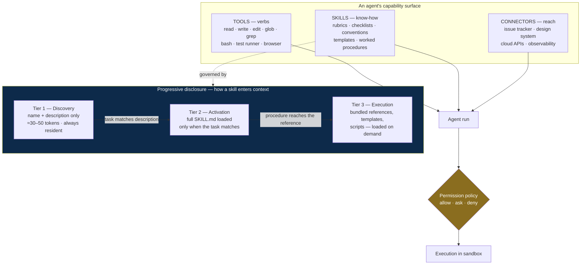

# 08 — Agent Skills, Tools, and Capabilities

An agent is a model plus what it knows how to do plus what it can act on. §2 specified the
roles; this document specifies the **capability surface** each one needs — and how that
surface stays small enough to fit in a context window.

## 8.1 Three distinct layers — do not conflate them

The single most common capability-design mistake is treating "give the agent a tool",
"teach the agent a procedure", and "connect the agent to a system" as one problem. They have
different lifecycles, different costs, and different failure modes.

| Layer | What it is | Cost model | Fails by |
|---|---|---|---|
| **Tools** | Verbs the agent can invoke; the harness executes them | Schema sits in context; each call costs a round trip | Too many tools → wrong tool chosen; too few → agent improvises via shell |
| **Skills** | Packaged procedural knowledge — a folder with a `SKILL.md` plus scripts, templates, references | Only name + description loaded until triggered | Vague description → never triggers, or triggers constantly |
| **Connectors (MCP)** | Standardized connections to external systems — issue trackers, design tools, cloud APIs | One integration per system, reusable across every agent | Unscoped credentials; unbounded tool surface |

**Skills are the layer most teams skip**, and they are the one that scales. A skill's name
and description stay resident at a cost of roughly 30–50 tokens; the full instruction file
loads only when the task matches, and bundled reference files load only when the procedure
reaches them. That three-tier **progressive disclosure** is what lets an agent carry dozens
of specialised procedures without any of them crowding out the actual work
([Anthropic Agent Skills](https://anthropic.skilljar.com/introduction-to-agent-skills),
[progressive disclosure as a design pattern](https://www.newsletter.swirlai.com/p/agent-skills-progressive-disclosure)).



## 8.2 The universal baseline

Every agent in the fleet gets this set. Deviations are listed per role in §8.4.

| Capability | Why every agent needs it | Restriction |
|---|---|---|
| `read`, `glob`, `grep` | Locating and reading code is the substrate of all the work | Confined to the run's worktree |
| `write`, `edit` | — | **Only** for roles with write authority (§8.6) |
| `bash` | The escape hatch for anything without a dedicated tool | Allowlisted executables, no shell operators, timeout, non-root |
| Symbol search / language server | Semantic navigation beats regex on real codebases | Read-only |
| Retrieval over the memory service | Context packs, repo map, contracts, prior decisions | Budgeted (§9.9) |
| Web search / fetch | Library docs, CVEs, standards, error messages | Egress allowlist |
| Memory read/write | Notes that survive compaction and lease expiry (§9) | Provenance-tagged; write-gated |
| Skill loading | Progressive disclosure of the role's procedures | Role-scoped skill set |

**Bash versus dedicated tools.** Start with bash for breadth; promote an action to a
dedicated tool when the harness needs to *do something with it* — gate it behind approval,
render it in a UI, audit it, or schedule it in parallel. The harness cannot tell a
parallel-safe `grep` from a destructive `git push` when both arrive as opaque command
strings, so it must serialise everything. A dedicated tool makes the action legible.

## 8.3 Design Agent (UX & Interface) — new role

The roster in §2 covers system design (Architect) and implementation (Frontend Implementer)
but leaves a gap between them: nobody owns what the thing looks like and how it behaves for
a user. That gap is where "technically passes acceptance criteria, unusable in practice"
lives. This role is a **peer of the Architect** — the Architect owns structure, the Design
Agent owns experience — and it runs in parallel with the Architect on the same spec.

| Field | Specification |
|---|---|
| **Role** | Turn the spec into interaction and interface decisions that implementers can build against without inventing UX. |
| **Inputs** | ProductSpec + acceptance criteria, design system / component inventory, design tokens, existing screens, accessibility standard, platform conventions |
| **Outputs** | `DesignDecision`: user flows, state inventory (empty / loading / partial / error / success / offline), component selection and any new components required, interaction and validation behaviour, copy for user-facing strings, accessibility annotations (roles, labels, focus order, contrast), responsive behaviour |
| **Design logic** | Work from the acceptance criteria outward. Enumerate **every state a screen can be in** before styling any of them — unhandled empty and error states are the most common gap between "the feature works" and "the feature is usable". Reuse existing components before proposing new ones; a new component requires a justification and goes into the design system, not into one feature. Where the brief is open-ended, propose 3–4 distinct directions with rationale and let a human choose rather than silently committing to one house style. |
| **Model tier** | T3 (design decisions are expensive to reverse once built) |
| **Tools** | Design-system/token store, component inventory, browser automation for visual inspection, contrast and accessibility checkers, screenshot diffing |
| **Guardrails** | May not write production code; may not introduce a new component without an entry in the design system; every interactive element must carry accessibility annotations; copy for user-facing strings is part of the deliverable, not left to the implementer |
| **Exit criteria** | Every acceptance criterion has a defined interface state; all states enumerated; accessibility annotations complete; design gate passes |

Its outputs are contracts in exactly the sense §2.3 means: frozen before parallel
implementation begins, so the Frontend Implementer builds against a decision rather than
guessing, and the Test Engineer can write assertions against defined states.

## 8.4 Skill and tool catalog by role

Skills are named as they would appear on disk (`skills/<name>/SKILL.md`). Bracketed items
are Anthropic-managed document skills where a deliverable is an office document.

### Definition layer

| Agent | Skills | Tools & connectors |
|---|---|---|
| **Requirements Analyst** | `writing-acceptance-criteria` (Given/When/Then + falsifiability self-test) · `ambiguity-triage` (assumption vs blocking question) · `scope-fencing` (non-goals) · `nfr-elicitation` · `domain-glossary` | Product-doc retrieval, issue tracker (MCP, read), `[pdf]` `[docx]` for reading supplied specs |
| **Architect** | `adr-authoring` (with rejected alternatives) · `api-contract-design` (OpenAPI / GraphQL SDL / protobuf) · `data-modeling` · `threat-modeling` (STRIDE deltas) · `nfr-budgeting` · `dependency-evaluation` (licence, maintenance, blast radius) · `diagramming` (mermaid) | Repo + dependency graph analysis, ADR retrieval, web search for technology evaluation, SCA/licence lookup |
| **Design Agent** | `flow-and-state-mapping` · `design-system-conformance` · `accessibility-wcag` · `interaction-and-validation-patterns` · `responsive-and-theming` · `ui-copywriting` · `dataviz` (when the feature renders data) | Design-token store, component inventory, design tool (MCP), browser automation, contrast/a11y checkers |
| **Task Decomposer** | `work-order-sizing` (historical calibration) · `dag-construction` · `criteria-coverage-mapping` · `shared-file-risk-analysis` | Repo map, dependency graph, historical metrics store |

### Construction layer

| Agent | Skills | Tools & connectors |
|---|---|---|
| **Backend Implementer** | `<language>-service-conventions` · `implement-from-contract` · `persistence-patterns` · `idempotency-and-retries` · `error-handling-taxonomy` · `structured-logging` · `authz-enforcement-patterns` | Sandboxed worktree, build/test runner, language server, package manager (mirror only), API docs retrieval |
| **Frontend Implementer** | `component-conventions` · `state-management-patterns` · `accessibility-implementation` · `form-and-validation-patterns` · `performance-budgets-frontend` · `dataviz` | Dev server, **browser automation for visual self-verification**, bundle analyser, design tokens, screenshot capture |
| **Data / Migration Implementer** | `expand-contract-migrations` · `backfill-strategies` · `query-optimization` · `index-design` · `data-classification` (PII tagging) | Database sandbox, `EXPLAIN`, migration runner, synthetic data generator (production data forbidden) |
| **Infra / Platform Implementer** | `iac-conventions` · `ci-pipeline-authoring` · `observability-instrumentation` (OpenTelemetry spans per §6.3) · `secrets-management` · `cloud-cost-awareness` | IaC plan (never apply without approval), CI config validation, cloud read APIs, policy-as-code linter |
| **Test Engineer** | `criteria-to-test-compilation` · `fixtures-and-factories` · `property-based-testing` · `concurrency-and-idempotency-tests` · `authz-negative-tests` · `e2e-authoring` · `flake-diagnosis` | Test frameworks, sandbox, coverage tooling, browser automation, fault injection |

### Judgement layer

| Agent | Skills | Tools & connectors |
|---|---|---|
| **Code Reviewer** | `review-rubric` (ordered: contract → correctness → error handling → concurrency → security-adjacent → resources → readability) · `failure-scenario-construction` · `convention-conformance` | Read-only repo, symbol search, `git blame`/history, ADR retrieval. **No write tools.** |
| **Security Agent** | `authz-review` (IDOR, tenant scoping, privilege escalation) · `trust-boundary-analysis` · `injection-sinks` · `secrets-and-logging-review` · `crypto-review` · `dependency-risk` · `compliance-mapping` (PII, retention, audit) | SAST/SCA/secret-scanner output, dependency graph, threat-model store, CVE lookup |
| **Performance Agent** | `benchmark-authoring` · `query-plan-analysis` · `bundle-budget-analysis` · `profile-interpretation` · `n-plus-one-detection` | Benchmark harness, profiler, `EXPLAIN`, bundle analyser, metrics store |
| **Commission seats (×10)** | One `jurisdiction-rubric-C<n>` per seat, plus its live Precedent Pack (§7.9). C4 additionally carries `skill-and-tool-audit` — it reads the invocation log to judge whether the right method was used | Read-only repo, verdict store, precedent corpus, invocation log. **No write tools, no network egress.** |

### Delivery layer

| Agent | Skills | Tools & connectors |
|---|---|---|
| **Refiner** | `root-cause-diagnosis` (hypothesis before edit) · `minimal-diff-repair` · `flake-vs-real-failure` · `bisect-and-blame` · `log-forensics` | Debugger, test runner, `git bisect`/`blame`, sandbox, log search |
| **Integrator** | `conflict-resolution` · `semantic-conflict-detection` · `changelog-generation` | Git, merge queue, full verification pipeline |
| **Documentation Agent** | `api-doc-generation` (from contracts and types, not prose) · `runbook-authoring` · `adr-indexing` · `changelog-conventions` · `[docx]` `[pptx]` `[xlsx]` `[pdf]` for stakeholder deliverables | Doc generator, contract schemas, doc linter |
| **Release Agent** | `progressive-delivery` (flags, canary, staged rollout) · `migration-runbooks` · `rollback-procedures` · `slo-and-alerting` · `incident-comms` | CI/CD, IaC apply (approval-gated), feature-flag service, metrics/alerting, incident tooling |

### Cross-cutting

| Agent | Skills | Tools & connectors |
|---|---|---|
| **Memory Curator** | `context-packing` (cache-friendly ordering) · `summarization-for-retrieval` · `repo-map-generation` · `memory-hygiene` (dedupe, contradiction detection) | Vector store, symbol index, git, memory store |
| **Supervisor** | `metric-anomaly-analysis` · `lesson-extraction` · `eval-authoring` · `prompt-versioning` · `skill-authoring` | Metrics store, event log, eval harness, prompt + skill registry |

## 8.5 Authoring standard for skills

A skill is a directory. `SKILL.md` carries front-matter metadata and the procedure; anything
long — reference tables, worked examples, templates, helper scripts — lives in sibling files
the procedure links to, so it loads only when reached.

```
skills/expand-contract-migrations/
├── SKILL.md              # name, description, the procedure itself
├── reference/
│   ├── postgres.md       # engine-specific detail, loaded on demand
│   └── mysql.md
├── templates/
│   └── migration.sql.tmpl
└── scripts/
    └── verify_backfill.py
```

Rules that decide whether a skill actually works:

1. **The description is the trigger, and it is the whole trigger.** It is the only part of
   the skill resident before activation, so it must state *when to use this*, not just what
   it is. "Expand/contract database migrations" never fires; "Use when a change alters a
   database schema — adding, removing, or changing columns, tables, or indexes" fires
   reliably. The same rule applies to tool descriptions: prescriptive "call this when…"
   descriptions measurably outperform descriptive ones.
2. **One skill, one procedure.** A skill that covers three loosely related things triggers
   on all three and helps with none.
3. **`SKILL.md` stays short.** If the procedure exceeds roughly a page, the detail belongs
   in a reference file. Length in Tier 2 is paid on every activation.
4. **State the failure modes.** A procedure that says what usually goes wrong outperforms
   one that only lists happy-path steps.
5. **Skills are versioned artifacts** with releases and rollbacks, exactly like prompts
   (§5.3), and they are eval-gated the same way — a skill that does not improve the golden
   task set does not ship.
6. **Skills are earned, not assumed.** The Supervisor drafts new skills from repeated
   escalations and Commission `rejected_patterns` (§7.9). That is the pipeline from "the
   fleet keeps making this mistake" to "the fleet knows how not to".

## 8.6 Permission matrix

Capability is not enough — the harness must enforce *who may do what*. Every tool call is
evaluated against the acting role's policy before execution.

| Capability | Definition agents | Implementers | Test Engineer | Judgement agents | Refiner | Integrator | Release |
|---|:---:|:---:|:---:|:---:|:---:|:---:|:---:|
| Read repo | ✅ | ✅ | ✅ | ✅ | ✅ | ✅ | ✅ |
| Write source files | ❌ | ✅ | ❌ | ❌ | ✅ | ✅ | ❌ |
| Write **acceptance tests** | ❌ | ❌ | ✅ | ❌ | ❌ | ❌ | ❌ |
| Write CI / gate config | ❌ | ❌ | ❌ | ❌ | ❌ | ❌ | ask |
| Run build & tests | ❌ | ✅ | ✅ | ✅ (read results) | ✅ | ✅ | ✅ |
| Network egress | allowlist | mirror only | mirror only | ❌ | mirror only | ❌ | allowlist |
| Merge to main | ❌ | ❌ | ❌ | ❌ | ❌ | ✅ | ❌ |
| Deploy / IaC apply | ❌ | ❌ | ❌ | ❌ | ❌ | ❌ | ask + human |
| Destructive migration | ❌ | ❌ | ❌ | ❌ | ❌ | ❌ | human only |
| Write to memory store | notes | notes | notes | ❌ | notes | notes | notes |
| Promote a lesson or skill | ❌ | ❌ | ❌ | ❌ | ❌ | ❌ | ❌ (Supervisor + human) |

Three rows carry most of the system's integrity: **only the Test Engineer writes acceptance
tests** (§2.5), **judgement agents have no write tools at all** (§7.3), and **nobody but the
Supervisor with human approval changes the fleet's procedural memory** (§9.6). Enforce these
in the harness, not the prompt — a guardrail that lives only in a prompt is a suggestion.

## 8.7 Scaling the tool surface

Tool schemas are resident context. Past roughly a few dozen tools, the agent starts choosing
wrong more often than it chooses right, and every extra schema is paid on every call.

- **Scope tools by role** first — an Implementer does not need the release toolchain, and
  giving it one is both a cost and a risk.
- **Defer loading** for large libraries: declare tools up front but let the agent search and
  surface only what the task needs. Because schemas are appended rather than swapped, this
  preserves the cached prefix that §5.2 depends on.
- **Prefer a connector to a bespoke integration.** A standard protocol (MCP) means one
  integration per external system rather than one per agent per system, which is why it has
  become the default interoperability layer for agent tooling
  ([MCP ecosystem, 2026](https://dev.to/sahil_kat/the-mcp-server-ecosystem-in-2026-integration-layer-for-ai-agents-2mln)).
  Scope its credentials per work order and treat every connector as untrusted input.
- **Never let tool count substitute for skill quality.** The usual reason an agent reaches
  for the wrong tool is that nothing told it when to reach for the right one.
