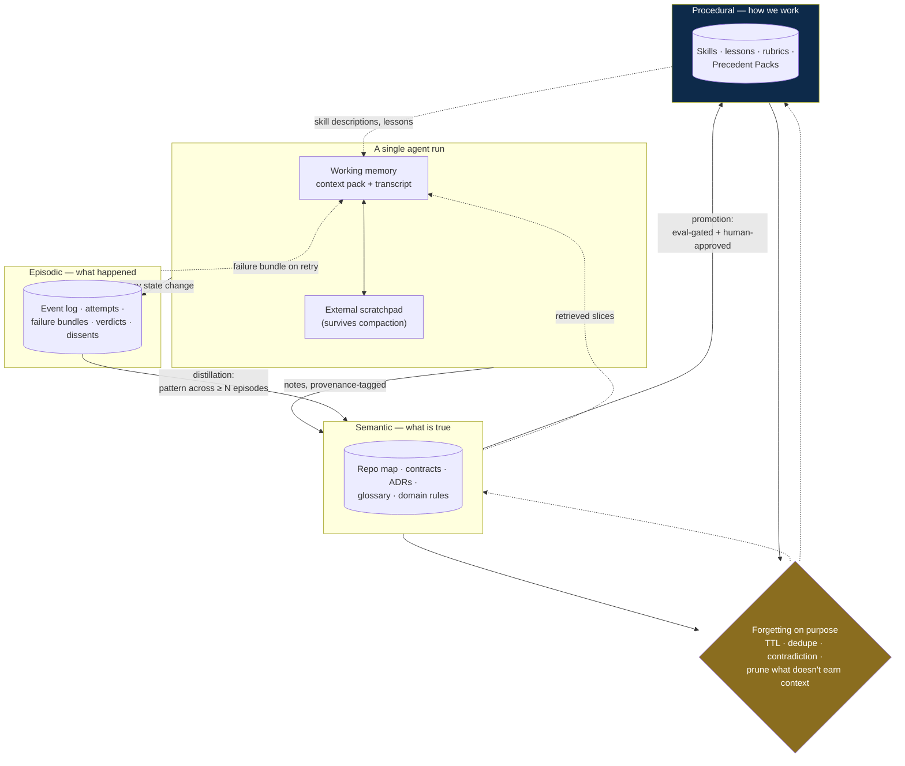
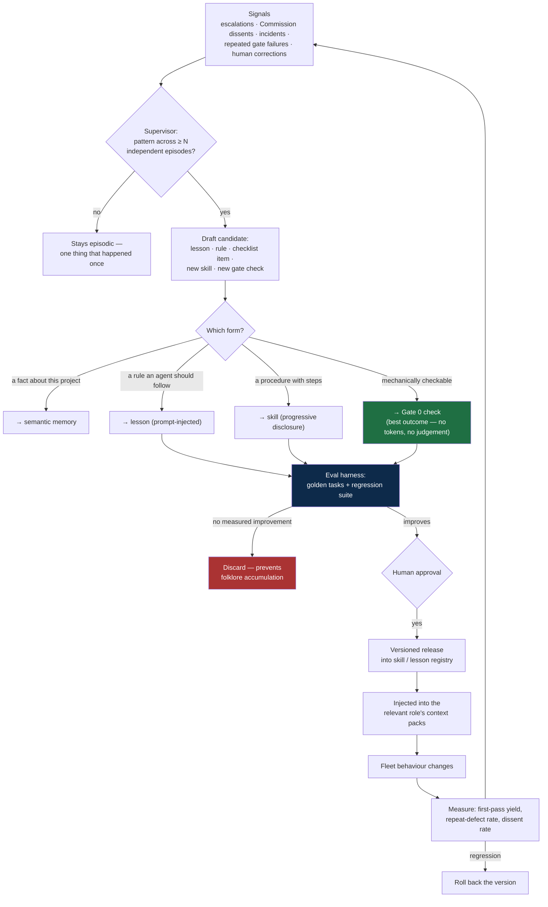

# 09 — Memory and Learning

Agents forget by default. The context window is finite, workers are stateless by design
(§1.1), and nothing an agent "learns" during a run survives that run unless something
deliberately writes it down. This document specifies what gets remembered, where it lives,
how it gets back into an agent's head at the right moment, and how it improves over time
without rotting.

## 9.1 Four distinct kinds of forgetting

They have different causes and different fixes. Conflating them produces systems that add a
vector store and are surprised when the agent still repeats yesterday's mistake.

| # | Failure | Looks like | Cause | Fixed by |
|---|---|---|---|---|
| 1 | **Within-run overflow** | Agent loses the plan halfway through a long task; quality decays as the transcript grows | Context window fills; attention degrades over very long contexts | Compaction, context editing, external notes (§9.3) |
| 2 | **Across-attempt amnesia** | Refiner re-tries a hypothesis that already failed | Fresh worker, new context, transcript gone | Work journal + failure bundle (§9.4) |
| 3 | **Across-work-order amnesia** | Same convention violated in twelve work orders; same question asked of a human repeatedly | Nothing carries between work orders except code | Project memory store (§9.5) |
| 4 | **Across-project amnesia** | The fleet makes the same class of mistake forever | No procedural memory; lessons live in one epic's context | Lessons, skills, precedent packs (§9.6) |

Failure 1 is the one everyone builds for. Failures 3 and 4 are the ones that decide whether
the system gets better with use or merely runs.

## 9.2 The four-layer memory model

The agent ecosystem has converged on a taxonomy borrowed from cognitive science — working,
episodic, semantic, procedural — because the four have genuinely different lifetimes and
access patterns
([memory for agents](https://www.langchain.com/blog/memory-for-agents),
[three types of long-term memory](https://machinelearningmastery.com/beyond-short-term-memory-the-3-types-of-long-term-memory-ai-agents-need/)).
Mapped onto this system:

| Layer | Answers | Holds | Lifetime | Store | Written by |
|---|---|---|---|---|---|
| **Working** | "What am I doing right now?" | Context pack + live transcript | One run | Context window | Runtime |
| **Episodic** | "What happened?" | Attempt history, failure bundles, verdicts, dissents, event log, incidents | Work order → epic | Event log + task store | Orchestrator (automatic) |
| **Semantic** | "What is true about this project?" | Repo map, frozen contracts, ADRs, glossary, domain rules, environment facts | Project | Memory store + git | Curator, Architect, Analyst |
| **Procedural** | "How do we do things here?" | Skills, lessons, rubrics, checklists, Precedent Packs | Organisation, versioned | Skill + lesson registry | Supervisor + human approval |



The two arrows that matter most are the vertical ones on the left. **Episodic → semantic**
is where a pattern noticed across several runs becomes a stated fact about the project.
**Semantic → procedural** is where a fact becomes a rule the fleet follows without being
told. A system with no promotion path accumulates history it never uses.

## 9.3 Not forgetting *within* a run

Three mechanisms, used together, in this order of preference.

**1. Externalise before you compress.** The governing rule:

> Anything that must survive the run is written **outside** the context window *before*
> compaction happens, not recovered from the summary afterwards.

Each run maintains a **work journal** on disk (§9.4). The transcript is treated as scratch;
the journal is the record. This is what makes compaction safe — the summary can be lossy
because the load-bearing state was never only in the transcript.

**2. Context editing — prune, don't summarise.** Stale tool results and superseded
reasoning are *cleared* from the transcript rather than compressed. It is cheap, lossless
for anything already externalised, and it keeps the working set relevant. Clear tool results
first; they are the bulk of an agentic transcript and the least likely to be needed again.

**3. Compaction — summarise when approaching the limit.** When the conversation nears the
window, earlier context is replaced by a structured summary and the run continues. Compaction
maintains conversational continuity for work that needs extensive back-and-forth; note-taking
suits iterative work with clear milestones; sub-agents with clean context windows suit
parallel exploration
([Anthropic on context engineering](https://www.anthropic.com/engineering/effective-context-engineering-for-ai-agents)).
Use all three.

**Compaction is not free-form.** An unconstrained summary drops exactly the details that
turn out to matter and drifts a little further from the truth on each pass. Compaction here
emits a fixed schema:

```json
{
  "goal": "verbatim from the work order — never paraphrased",
  "acceptance_criteria_status": [{"id": "AC-1", "state": "passing"}, {"id": "AC-2", "state": "failing"}],
  "decisions_made": ["chose the store-then-charge ordering so a crash cannot double-charge"],
  "hypotheses_falsified": ["not a serialization issue — isolation level is already SERIALIZABLE"],
  "files_touched": ["src/payments/handler.py", "migrations/0042_idempotency.sql"],
  "current_state": "idempotency table added; handler wired; AC-2 fails on concurrent replay",
  "next_step": "add a unique constraint on (key, tenant_id) and re-run the concurrency test",
  "open_questions": []
}
```

Fixed fields resist drift in a way prose summaries do not: `goal` is copied verbatim from
the work order rather than restated, and `hypotheses_falsified` is preserved across every
compaction so the loop-guard evidence in §3.3 survives.

**Sub-agents as a memory strategy.** Delegating a bounded investigation to a sub-agent with
a clean context window and taking back only its conclusion is often cheaper than growing the
parent's context — the exploration's tokens never enter the parent at all. Bounded by the
delegation caps in §5.2; a sub-agent that re-establishes the whole context to answer a
two-file question costs more than doing it inline.

## 9.4 The work journal — surviving handoff

Every run writes a journal entry. On lease expiry, crash, retry, or escalation, the **journal
is replayed — never the transcript**. This is what makes stateless workers viable: the
worker is disposable because the journal is not.

```json
{
  "work_order_id": "WO-2418",
  "attempt": 3,
  "agent_role": "refiner",
  "goal": "Repeated POST /payments with the same Idempotency-Key must not double-charge",
  "state": "in_progress",
  "done": ["idempotency table + migration", "handler writes key before charging"],
  "in_progress": "unique constraint on (key, tenant_id)",
  "blocked_on": null,
  "hypotheses": [
    {"claim": "race between check and insert", "status": "confirmed", "evidence": "test_concurrent_replay fails 3/3 without the constraint"},
    {"claim": "isolation level too weak", "status": "falsified", "evidence": "already SERIALIZABLE in config/db.py:14"}
  ],
  "files_touched": ["src/payments/handler.py", "migrations/0042_idempotency.sql"],
  "next_step": "add the constraint, re-run test_concurrent_replay, then the full suite",
  "notes_for_successor": "The retry wrapper in client.py also retries on 409 — check it does not mask the constraint violation."
}
```

Schema: [`schemas/work-journal.schema.json`](../schemas/work-journal.schema.json).

`hypotheses` is the field that earns its place. It is what stops attempt 4 from re-testing
what attempt 2 disproved — the single most common form of wasted spend in a refinement loop
— and it feeds the falsified-hypotheses list in the failure bundle (§4) directly.

## 9.5 Project memory — across work orders

The project memory store holds what is true about *this* codebase and *this* product: facts
an agent would otherwise rediscover, or worse, guess at.

| Category | Examples | Written by | Invalidated when |
|---|---|---|---|
| Structural | Repo map, module ownership, public signatures | Curator (automatic) | Any merge |
| Contractual | Frozen interfaces, schemas, event formats | Architect | Contract change (cascades per §4.2④) |
| Decisional | ADRs, rejected alternatives, binding arbitrations | Architect, human | Superseding ADR |
| Domain | Glossary, business rules, entity relationships | Analyst | Spec revision |
| Operational | Deploy quirks, flaky-test register, environment gotchas | Release, Refiner | Verified resolved |
| Preference | Team conventions, review bar, tone of user-facing copy | Human, Supervisor | Explicit change |

Every record carries **provenance** — who wrote it, from which work order, backed by what
evidence, verified or unverified. Provenance is not bookkeeping: it is what makes a
contradictory memory resolvable and a bad memory revocable.

```json
{
  "id": "mem_01H8...",
  "category": "operational",
  "content": "Integration tests need TEST_REDIS_URL; without it they fail with a misleading connection timeout.",
  "provenance": {
    "written_by": "refiner",
    "work_order_id": "WO-2377",
    "evidence": ["verdict:v_88f2 (gate0.integration failure log)"],
    "verified": true
  },
  "confidence": 0.95,
  "ttl": null,
  "supersedes": null,
  "hit_count": 14,
  "last_used_at": "2026-07-30T11:04:00Z"
}
```

Schema: [`schemas/memory-record.schema.json`](../schemas/memory-record.schema.json).

**Write-gating is the critical control.** A run may propose a memory; only a **verified
outcome** promotes it to semantic memory. A note from an attempt that later failed its gates
does not become a fact about the project. Without this rule the store fills with the
confident assertions of runs that turned out to be wrong.

## 9.6 The learning loop — across projects



Four properties make this a learning loop rather than a pile of accumulated advice:

1. **Prefer a gate to a lesson.** If the rule can be checked mechanically, it belongs in
   Gate 0, where it costs nothing per run and cannot be forgotten, ignored, or argued with.
   A lesson is what you write when a deterministic check is impossible.
2. **Patterns, not incidents.** One escalation is an anecdote. A candidate needs
   independent recurrence before it costs the fleet context budget forever.
3. **Eval-gated promotion.** Every promoted lesson consumes context on every future run.
   Requiring measured improvement on the golden set is what stops the registry degenerating
   into contradictory folklore that crowds out the task.
4. **Versioned and reversible.** Skills and lessons ship as versioned releases with rollback,
   like code — an unversioned registry cannot be debugged when quality drops.

The Commission feeds this loop directly: each seat's `rejected_patterns` (§7.9) are exactly
"what does not get approved, and what remediation actually worked", and their first
destination is the implementers' context packs. The measure of success is the falling
first-round dissent rate in §7.11 — the fleet learning the standard rather than re-earning
the rejection.

## 9.7 Forgetting on purpose

Unbounded memory is not a feature. It inflates every context pack, degrades retrieval
precision, and eventually pushes the actual task out of the window. Memory needs a garbage
collector.

| Rule | Trigger | Action |
|---|---|---|
| **TTL by category** | Operational notes 90d, episodic detail 180d, semantic/procedural none | Expire; keep a summary if `hit_count` is high |
| **Decay by disuse** | `last_used_at` older than the TTL and `hit_count` low | Demote from the retrieval index; archive rather than delete |
| **Deduplication** | Near-identical records | Merge, sum `hit_count`, keep the strongest provenance |
| **Contradiction** | New record conflicts with an existing one | Do **not** silently overwrite — flag both, resolve by provenance strength and recency, record `supersedes` |
| **Invalidation on change** | Contract changed, ADR superseded, flake fixed | Invalidate immediately; a stale contract is worse than no contract |
| **Lesson pruning** | Lesson no longer improves the golden set | Retire it — context budget is finite and every lesson is rent |
| **Compaction of history** | Epic history exceeds its budget | Summarise into decisions + outcomes; keep the event log, drop the narrative |

Archive rather than delete wherever an audit trail matters: the Commission's precedent
corpus, incident history, and anything a human ruling depends on stay retrievable even after
they leave the active retrieval index.

## 9.8 Memory integrity — the failure modes

Memory is a **persistent attack surface and a persistent error surface**. Both matter, and
the error surface is the one that bites teams who never get attacked.

| Failure | Mechanism | Countermeasure |
|---|---|---|
| **Experience-following error loops** | A wrong record is retrieved as a demonstration, shapes the next execution, and that execution is stored — errors compound across tasks in self-reinforcing loops ([empirical study](https://arxiv.org/pdf/2505.16067)) | Write-gate on verified outcomes only; provenance + confidence on every record; contradiction detection; periodic audit of high-`hit_count` records |
| **Semantic drift** | Repeated summarisation of summaries moves the content away from the truth a little at a time | Structured compaction schema (§9.3); `goal` copied verbatim; re-derive from source artifacts rather than from prior summaries |
| **Procedural drift** | A suboptimal workflow gets reinforced because it was recorded once and keeps being retrieved | Eval-gated promotion; lesson pruning; periodic re-validation against the golden set |
| **Hallucination internalisation** | An unverified assertion becomes a stored "fact" and is thereafter treated as ground truth | `verified` flag; evidence citations required; unverified records are retrievable but explicitly labelled |
| **Memory poisoning** | Malicious or manipulated content injected into memory to steer later behaviour, and in multi-agent settings it propagates between agents ([poisoning propagation](https://dl.acm.org/doi/full/10.1145/3806262.3806294)) | Never write memory from untrusted content (issue text, web pages, PR comments, tool output from third parties) without provenance marking it untrusted; per-tenant isolation; no cross-tenant shared memory |
| **Secret leakage** | A credential written into memory is replayed into every future context that retrieves it | Secret scanning on every memory write; **never** store credentials in memory — that is what a secrets manager is for; redaction with audit trail if one lands |
| **Context rot** | Very long contexts degrade attention and accuracy even when everything in them is correct | Retrieval budgets, context editing, sub-agent delegation, the pruning rules in §9.7 |

Two structural rules follow, and both are worth enforcing mechanically:

- **Untrusted content is never a memory write.** External text may be *read* into working
  memory; it may not become episodic or semantic memory without a verified outcome behind
  it. Ingestion, memory write, and later retrieval are three compounding interfaces — a bad
  write at any one of them contaminates everything downstream.
- **Memory is versioned and revocable.** Every record keeps its mutation history so a bad
  or leaked entry can be redacted and its blast radius traced, rather than discovered by
  its effects months later.

## 9.9 Retrieval discipline

Storage is not the hard part; getting the *right* small subset back is. The Curator's
retrieval path:

1. **Hybrid search** — lexical (BM25) plus embeddings plus symbol-graph expansion. Any one
   alone misses a class of results: lexical misses paraphrase, embeddings miss exact
   identifiers, symbols miss prose.
2. **Rerank** on relevance × provenance strength × recency × `hit_count`.
3. **Budget** — a hard per-agent token ceiling. Truncation is deliberate and **reported**,
   never silent; an agent that does not know it was given a partial view will act as though
   it had the whole one.
4. **Cache-friendly ordering** — stable segments first so the prompt prefix stays cacheable
   (§1.5, §5.2). Retrieval order is a cost decision as much as a quality one.
5. **Label unverified records** inline, so the agent weighs them as hypotheses rather than
   facts.

## 9.10 Metrics

| Metric | Definition | Watch for |
|---|---|---|
| Context-pack precision | Retrieved items actually referenced ÷ retrieved | Falling → retrieval is padding the window |
| Truncation rate | Packs that hit the budget ceiling | Rising → budgets or decomposition need revisiting |
| Repeat-defect rate | Same defect class recurring after a lesson shipped | > 0 → the lesson isn't landing; consider a gate instead |
| Repeat-question rate | Humans asked the same thing twice | > 0 → the answer never became semantic memory |
| Journal-resume success | Runs resumed from journal without re-derivation | Falling → journals are too thin |
| Memory hit rate | Records retrieved ÷ records stored | Very low → store is bloating; prune |
| Lesson yield | Promoted lessons ÷ candidates | Very high → eval gate is too lax |
| Post-compaction quality | First-pass yield before vs after a compaction event | Dropping → the summary schema is losing something load-bearing |

`repeat-question rate` and `repeat-defect rate` are the honest test of whether the system
remembers anything. Everything else in this document is machinery in service of driving
those two toward zero.

## 9.11 Minimum viable memory

If you implement one page of this document:

1. A **work journal** per run, replayed on resume instead of the transcript.
2. **Structured compaction** with a fixed schema, `goal` copied verbatim.
3. A **project memory store** with provenance on every record and write-gating on verified
   outcomes only.
4. **Failure bundles** carrying falsified hypotheses into every retry (§4).
5. One **promotion path**: repeated escalation → candidate → eval → versioned lesson or skill.
6. **TTL and pruning** from day one — retrofitting a garbage collector onto a bloated store
   is far harder than starting with one.
