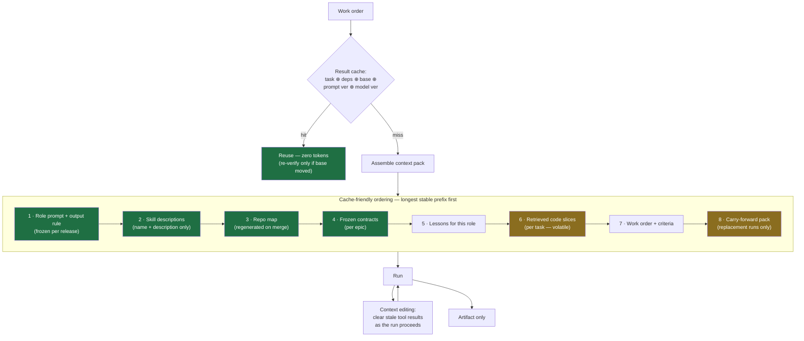
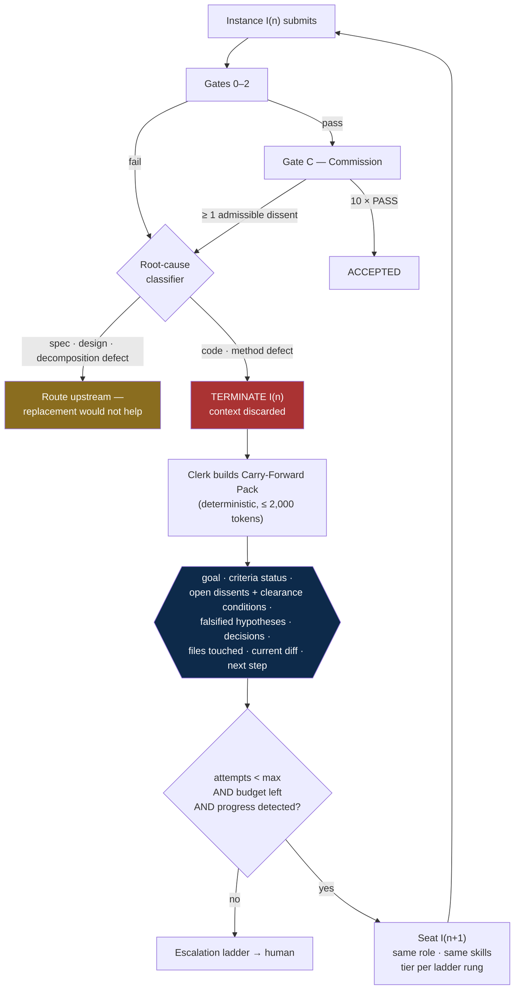

# 10 — Token Efficiency and Instance Replacement

Two changes, applied fleet-wide:

1. **Agents produce artifacts, not narration.** No preamble, no progress commentary, no
   post-hoc explanation of work the diff already shows.
2. **A rejected instance is terminated and replaced**, not coached. The replacement inherits
   the knowledge in distilled form and retries with a clean context.

Both are quality measures as much as cost measures. The second is the more important one:
a rejected run's context is the most expensive and least useful context in the system.

## 10.1 Three kinds of tokens — only one is waste

The single most expensive mistake available here is cutting the wrong thing. Classify before
optimising.

| Kind | Examples | Verdict |
|---|---|---|
| **Narration** | "I'll now examine the handler…", "Let me check…", restating the task, summarising a diff the reader can see, listing alternatives not taken | **Cut to zero.** Pure waste — no downstream consumer |
| **Evidence** | `root_cause`, `failure_scenario`, `remediation_condition`, `falsified_hypotheses`, `contract_deviations` | **Cap, never cut.** Each is a required input to another stage |
| **Reasoning** | Internal thinking before acting | **Tune per role.** Cutting it degrades quality and costs *more* in retries |

**Why evidence stays.** A dissent without a clearance condition is unfalsifiable and never
converges (§7.4). A failure bundle without falsified hypotheses causes attempt 4 to re-test
what attempt 2 disproved (§9.4). Deleting those fields saves a few hundred tokens per call
and costs a full extra loop — a run of 40k–100k. That trade is negative by an order of
magnitude, so evidence fields survive under hard caps instead.

**Why reasoning is different from narration.** Suppressing what an agent *says* is nearly
free. Suppressing how much it *thinks* is not: under-thinking on a complex work order shows
up as a failed gate, and a failed gate costs a whole replacement cycle. Narration goes to
zero everywhere; reasoning is set per role in §10.6.

## 10.2 Output discipline — the global rule

Every agent's system prompt carries this block, verbatim:

> Emit only the artifact. No preamble, no commentary between tool calls, no summary
> afterwards, no restating the task, no explaining choices the artifact already shows, no
> listing options you did not take. If a field is not required by your output schema, do not
> produce it. When a required field asks for a reason, give the reason in one sentence — a
> claim and its evidence, not an argument.

Enforced mechanically, not by trust:

- **Schema-constrained outputs.** Every artifact is validated at the boundary (§4.2②). No
  free-text wrapper around the JSON — the response *is* the object.
- **`max_tokens` per artifact type** (§10.5). Hitting the cap is a schema violation, not a
  truncated success.
- **No `notes` field unless it carries a decision another stage consumes.** The
  `Patch.notes` field is now capped and populated only when an assumption or contract
  deviation exists; otherwise it is absent.
- **Silence between tool calls.** An agent working through ten tool calls emits nothing
  between them.

### Per-role output contract

| Role | Artifact | Prose permitted | Output cap |
|---|---|---|---|
| Requirements Analyst | `ProductSpec` | Criteria text only | 3,000 |
| Architect | `ArchitectureDecision` + contracts | ADR rationale, 1 sentence per rejected option | 6,000 |
| Design Agent | `DesignDecision` | State labels + copy strings only | 4,000 |
| Task Decomposer | Work-order DAG | None | 4,000 |
| Implementer | `Patch` | None — diff only | 8,000 |
| Test Engineer | Test files + coverage map | None | 8,000 |
| Verifier | `Verdict` | None (deterministic) | — |
| Code Reviewer | `Finding[]` | `failure_scenario`, 1–2 sentences | 1,500 |
| Security Agent | `SecurityFinding[]` | attacker / precondition / impact, 1 line each | 1,500 |
| Performance Agent | Regression report | Numbers only | 800 |
| Refiner | `Patch` + `root_cause` | `root_cause`, 1 sentence | 4,000 |
| Integrator | Merge result | Conflict rationale only when ambiguous | 2,000 |
| Documentation Agent | Docs delta | The docs themselves | 3,000 |
| Release Agent | Deployment plan | Runbook steps | 2,000 |
| Commission seat — PASS | `{seat, vote: "PASS"}` | **None** | 50 |
| Commission seat — DISSENT | `Dissent` | failure statement + remediation condition | 400 |
| Supervisor | Lessons, tuning proposals | Analysis | 4,000 |

The Commission row is the largest single saving in the design. Ten seats × three rounds,
each previously writing a paragraph of rationale, is ~12,000 tokens of prose per work order
that no downstream stage reads. **A PASS vote now carries no rationale at all** — a seat that
agrees has nothing to contribute, and its agreement is fully expressed by the vote. Rationale
is required only when a seat blocks, because only then does someone have to act on it.

## 10.3 Input-side optimization

Output is the visible cost; input is usually the larger one. In an agentic loop the same
context is re-sent on every turn.

Levers, in order of measured impact:

1. **Don't make the call.** The cheapest token is the one never sent. Result caching, test-impact
   analysis, gate-first ordering (never spend an LLM gate on code that does not compile), and
   deduplicated work orders eliminate calls outright.
2. **Cache the prefix.** Segments 1–5 above are byte-stable across every run in an epic and
   across all ten Commission seats judging the same dossier. One rule protects this: **nothing
   volatile may appear before segment 6** — no timestamps, no run IDs, no per-agent
   interpolation in the role prompt. A single varying byte at segment 1 invalidates everything
   after it.
3. **Progressive disclosure for skills.** Descriptions resident (~30–50 tokens each), bodies
   on activation, references on demand (§8.1). Dozens of procedures for the price of a few
   hundred tokens.
4. **Retrieval budgets, tightened.** Per-role ceilings in §10.5, enforced by the Curator, with
   truncation reported rather than silent.
5. **Context editing during the run.** Clear stale tool results as they age out of relevance;
   they dominate an agentic transcript and are rarely needed twice.
6. **Diffs, never files.** Implementers emit unified diffs. Full-file rewrites are rejected at
   the boundary.
7. **Batch the small stuff.** Nit-level findings, doc updates, and lint fixes go in one call.

## 10.4 Instance replacement — the retry protocol

**On rejection the instance is terminated, not corrected.** A fresh instance of the same role
is seated with the same skills and the same knowledge in distilled form, and retries.

### Why replacement beats coaching

| | Continue with the same instance | Replace |
|---|---|---|
| Context carried | Full transcript: dead ends, rejected diff, wrong-path reasoning | Distilled pack, ≤ 2,000 tokens |
| Cost per subsequent turn | Grows with every attempt | Flat |
| Anchoring | Defends and patches its own rejected approach | Reads the evidence cold |
| Failure signature | Tends to repeat — the same reasoning produced it | Genuinely fresh attempt |

The rejected transcript is the worst context in the system: longest, most polluted, and
biased toward the approach that just failed. Discarding it is the optimization *and* the
quality fix. This also matches how the Commission already works — seats rotate and hand
forward a Precedent Pack rather than a transcript (§7.8).

### The Carry-Forward Pack

"Same knowledge" means **distilled knowledge, never the transcript.** Replaying the
transcript into the successor would preserve the anchoring and save nothing.

Built by the deterministic Clerk — never by the terminated instance, which cannot be trusted
to summarise its own failure — and capped at 2,000 tokens:

| Field | Why it survives |
|---|---|
| `goal` (verbatim) | Paraphrase is where drift starts |
| `acceptance_criteria_status` | What already passes must not regress |
| `open_dissents[]` with clearance conditions | The successor's actual acceptance bar |
| `falsified_hypotheses[]` | Forbidden to re-test — the largest single source of wasted retries |
| `decisions_and_constraints[]` | Prevents re-deriving what was already settled |
| `files_touched[]` | Scope |
| `current_diff` | The work product is kept; only the reasoning around it is discarded |
| `next_step` | One line the successor can start from |

Schema: [`schemas/carry-forward-pack.schema.json`](../schemas/carry-forward-pack.schema.json).

### Bounds — replacement is not unlimited

Unbounded respawn is the same non-converging loop as unbounded retry, wearing a different
hat. All existing ceilings apply unchanged:

| Rule | Value |
|---|---|
| Replacements per work order | = `max_attempts` (default 3, hard cap 6) |
| Budget on replacement | **Does not reset** — the successor inherits the remaining token, cost, and wall-clock budget |
| No-progress detector | Applies across instances: identical failure signature from two successive instances skips straight to Rung 4 |
| Root-cause gate | Replacement is only correct for `code_defect` and `method_and_skills` dissents |
| Escalation | Exhausted replacements → human, with the full ledger |

**The root-cause gate is the load-bearing guardrail.** Replacing the implementer because C1
found the requirements unmet, or C10 found the evidence incomplete, cannot possibly work —
the next instance faces the same ambiguous spec and fails identically. Spec, design, and
decomposition defects route upstream (§3.3); only code and method defects trigger
replacement.

### Updated escalation ladder

Each rung still changes something structural, and no rung repeats:

| Rung | Action |
|---|---|
| 0 | Replace instance — same role, same tier, carry-forward pack |
| 1 | Replace + broader retrieval (the pack showed a context gap) |
| 2 | Replace + stronger model tier |
| 3 | Replace with a **different role** — Refiner or specialist |
| 4 | Re-plan: split the work order or revise the contract |
| 5 | Human intervention with the full evidence pack |
| 6 | Cancel or defer — human decision |

## 10.5 Budget table

Starting points, to be replaced with measured values. All are hard ceilings, enforced by the
Orchestrator; breach is a failure, not a truncation.

| Role | Context pack in | Output cap | Thinking | Tier |
|---|---:|---:|---|---|
| Requirements Analyst | 40,000 | 3,000 | high | T3 |
| Architect | 80,000 | 6,000 | high | T3 |
| Design Agent | 50,000 | 4,000 | high | T3 |
| Task Decomposer | 50,000 | 4,000 | medium | T3 |
| Implementer — mechanical | 15,000 | 8,000 | low | T1 |
| Implementer — standard | 40,000 | 8,000 | medium | T2 |
| Implementer — complex/high risk | 80,000 | 8,000 | high | T3 |
| Test Engineer | 40,000 | 8,000 | medium | T2 |
| Code Reviewer | 30,000 | 1,500 | medium | T2 |
| Security Agent | 30,000 | 1,500 | high | T3 |
| Performance Agent | 20,000 | 800 | low | T2 |
| Refiner — attempt 1 | 25,000 | 4,000 | medium | T2 |
| Refiner — attempt ≥ 2 | 40,000 | 4,000 | high | T3 |
| Integrator | 30,000 | 2,000 | low | T2 |
| Documentation Agent | 25,000 | 3,000 | low | T1 |
| Release Agent | 25,000 | 2,000 | medium | T2 |
| Commission seat | 25,000¹ | 50 / 400² | medium–high | T2/T3 |
| Supervisor | 60,000 | 4,000 | high | T3 |

¹ The sealed dossier is identical across all seated seats, so it is written to cache once and
read by every seat — ten judgements at roughly one dossier's input cost.
² 50 for PASS, 400 for DISSENT.

## 10.6 Reasoning depth per role

The lever that most affects both cost and quality. Set it by consequence-of-error, not by
seniority.

| Depth | Roles | Rationale |
|---|---|---|
| **Low** | Mechanical implementation, docs, integration, performance measurement | The answer is largely determined by the input; Gate 0 catches slips cheaply |
| **Medium** | Standard implementation, tests, review, refiner attempt 1, release | Balanced default |
| **High** | Analyst, Architect, Design, Security, Refiner attempt ≥ 2, Supervisor, high-risk Commission seats | An error is expensive, hard to reverse, or invisible to deterministic checks |

Two rules keep this honest:

- **Escalate depth on retry, not breadth.** A second attempt at the same depth usually
  reproduces the first result.
- **Never reduce depth to shorten output.** They are separate controls. Output length is set
  by §10.2's contract and the `max_tokens` cap; reasoning depth is set here. Lowering depth to
  get shorter answers buys a brief saving and pays for it in a replacement cycle.

## 10.7 Commission cost control

Ten judges is the most expensive component in the design, and it sits on the critical path.
Four controls, none of which weakens the unanimity rule:

1. **PASS carries no rationale** (§10.2) — the largest saving.
2. **Shared cached dossier** — sealed once, read by all ten seats.
3. **Gates 0–2 first** — the Commission only ever judges candidate-clean work.
4. **Bench composition by risk class** — low-risk work seats five (C1, C2, C3, C8, C10);
   medium and high seat all ten. Governs *which seats are seated*, never whether a seated
   seat's dissent binds (§7.12).

Full bench remains the default until per-seat false-dissent rate *q* is measured and stable.
A rising *q* is the expensive failure here: at q = 0.05 only 60% of clean work is accepted
first round, and every spurious rejection now costs a full replacement cycle.

## 10.8 Guardrails against over-optimization

Cost is a term in the objective; quality is a constraint (§5.1). These four detectors catch
optimization that has started eating the product:

| Signal | Means | Response |
|---|---|---|
| Rework ratio rising while cost/call falls | Budgets or reasoning depth cut too far — paying in retries | Restore depth on the affected role |
| Escaped defect rate rising | Reviewers or seats starved of context | Raise their retrieval budget first |
| Findings without `failure_scenario` | Output caps squeezing evidence into invalidity | Raise the cap; evidence is not narration |
| Replacement count ≈ attempt ceiling routinely | Replacement is masking an upstream defect | Check the root-cause classifier, not the implementer |

**The metric that decides whether this worked** is cost per *merged* work order, not cost per
call. Cutting cost per call while rework rises is a loss dressed as a saving.
