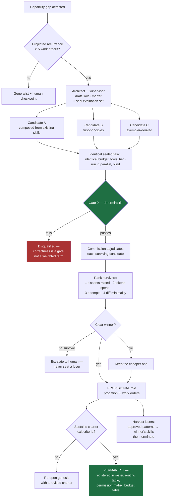
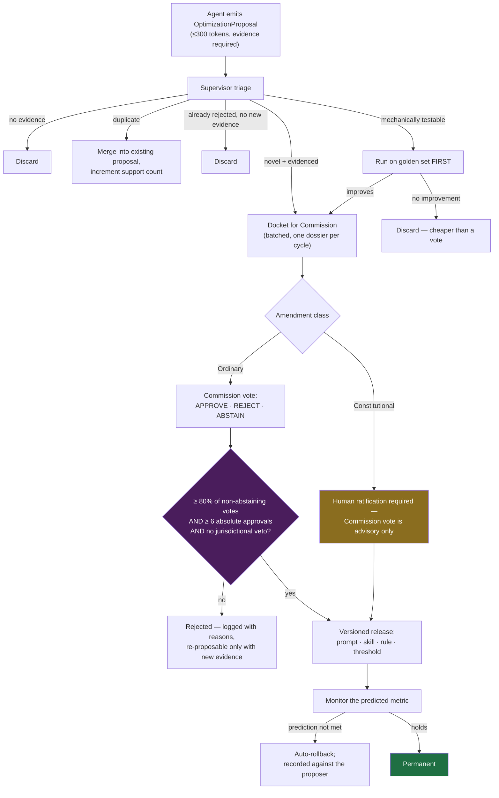

# 11 — Capability Genesis and Amendments

Two ways the fleet changes itself:

- **Genesis** — no agent is specialised for a task, so three candidates compete for the role
  and the winner becomes permanent.
- **Amendment** — any agent proposes an optimization; the Commission approves it at 80% and
  it becomes permanent.

Both are bounded, evidence-gated, and reversible. Neither may weaken a constitutional
guardrail (§11.9).

---

## 11.1 Genesis trigger

| Trigger | Detection | Threshold |
|---|---|---|
| **Hard gap** | Routing finds no pool whose capability manifest matches the work order | Immediate |
| **Soft gap** | A pool nominally matches but its first-pass yield on this work-order class is far below its own baseline | < 40% over ≥ 8 runs |
| **Chronic escalation** | Work-order class escalates to human repeatedly with no code defect found | ≥ 3 escalations |

**Recurrence gate.** Genesis costs 3× one work order. It runs only when the capability is
projected to recur (≥ 5 work orders, from the DAG and backlog). A genuine one-off routes to
the nearest generalist with a human checkpoint — paying triple for a task that never returns
is the obvious way to make this mechanism a net loss.

## 11.2 Role Charter — written before any candidate runs

Candidates cannot be compared fairly without a definition of the job. The Architect and
Supervisor jointly draft a **Role Charter** using the same eight fields as every agent spec
(§2): role, inputs, outputs, design logic, model tier, tools, guardrails, exit criteria.

The charter also fixes the **evaluation set**: the trial work order plus 2–4 sealed
historical or synthetic tasks of the same class, with known-good outcomes. Sealed before the
candidates exist, so it cannot be written to favour one of them.

Schema: [`schemas/role-charter.schema.json`](../schemas/role-charter.schema.json).

## 11.3 The three candidates — one controlled variable

Three agents that differ randomly produce noise, not a signal. They differ in exactly one
dimension: **how their procedural knowledge is composed.** Everything else — charter,
context pack, tools, budget, model tier, sealed task — is identical.

| Candidate | Composition | Tends to win when |
|---|---|---|
| **A — Composed** | Assembled from existing skills and the nearest adjacent role's prompt | The gap is a recombination of things the fleet already does |
| **B — First-principles** | Charter only; no borrowed procedure | Existing conventions are the problem, not the solution |
| **C — Exemplar-derived** | Distilled from how humans solved this class in the history log | There is prior art and the task is convention-heavy |

## 11.4 Judging

Existing machinery, no new judges:

1. **Gate 0 is a qualifier, not a score.** A candidate whose work does not build, typecheck,
   and pass tests is disqualified outright. Elegance never compensates for incorrectness.
2. **The Commission adjudicates each survivor** against the same sealed dossier standard as
   any other work (§7). Its verdict is the primary ranking input.
3. **Ranking among survivors**, in strict priority order:

| Rank key | Why it is above the next |
|---|---|
| 1. Admissible dissents raised (fewer wins) | Quality of the work, judged by the existing bar |
| 2. Tokens consumed | Two correct solutions are not equal if one costs triple |
| 3. Attempts to reach acceptance | First-pass yield is the metric that compounds |
| 4. Diff minimality | Proxy for scope discipline |

Ties go to the cheaper candidate. **If no candidate survives Gate 0, none is seated** — the
gap escalates to a human with all three transcripts. Seating the least-bad of three failures
installs a permanent weakness.

## 11.5 Probation before permanence

A single task is a sample of one. The winner is seated **provisionally** and must sustain the
charter's exit criteria across **5 work orders** before promotion to permanent. Probation
failure re-opens genesis with a revised charter rather than promoting the runner-up — the
runner-up already lost on the same evidence.

This is the one place I have deliberately not implemented "best of one becomes permanent"
literally: tournament winners on a single task are frequently noise, and a permanent role
installed on noise is expensive to detect and expensive to remove.

## 11.6 Elimination — harvest before terminating

Losing candidates are terminated, but their runs are already paid for. Before termination the
Supervisor extracts any pattern the Commission marked as approved in a loser's dossier and
folds it into the winner's skill pack. Two-thirds of the genesis cost otherwise buys nothing.

Terminated candidates leave behind: their charter-relative scores, the harvested patterns,
and the transcript for audit. Nothing else persists.

---

## 11.7 Amendments — any agent may propose

Any agent may emit an `OptimizationProposal` alongside its artifact. This is the fleet's own
improvement channel, and it is deliberately narrow so it does not become narration by another
name.

**A proposal is invalid without all four fields:**

| Field | Requirement |
|---|---|
| `observation` | The inefficiency, with evidence from an actual run — a work-order id, a metric, a verdict |
| `change` | The concrete change. Not "improve retrieval" — the specific rule, value, or prompt edit |
| `expected_effect` | A measurable prediction: which metric moves, in which direction, by roughly how much |
| `risk` | What this could break, and which guardrail it touches |

Capped at 300 tokens. **One proposal per agent per work order.** A proposal without evidence
is discarded at intake without reaching the Commission.

Schema: [`schemas/optimization-proposal.schema.json`](../schemas/optimization-proposal.schema.json).

## 11.8 The amendment process

### The 80% rule, precisely

| Element | Rule |
|---|---|
| Who votes | Every seated commissioner |
| Options | `APPROVE`, `REJECT`, `ABSTAIN` (abstain permitted only outside the seat's jurisdiction) |
| Threshold | **≥ 80% of non-abstaining votes** approve |
| Absolute floor | **≥ 6 approvals** regardless of abstentions — prevents a 2-vote amendment passing on mass abstention |
| Jurisdictional veto | **C6 (Security)** and **C10 (Evidence & Process)** hold an absolute veto over proposals touching their jurisdiction. A security-weakening optimization does not pass 8–2 |
| Rationale | Required on `REJECT` only — approvals carry no prose (§10.2) |

**Why 80% here and unanimity at Gate C.** These govern different things and the difference is
deliberate. Unanimity protects *accepting work*: one seat spotting a real defect must be able
to stop it shipping, because the cost of shipping a defect is borne by users. Supermajority
governs *changing the system*: unanimity there would let a single seat freeze the fleet
permanently, and a simple majority would let it churn. 80% plus an absolute floor plus two
jurisdictional vetoes is the balance — hard to pass a bad amendment, possible to pass a good
one.

### What may be amended

| Ordinary — 80% Commission vote | Constitutional — human ratification |
|---|---|
| Prompt and skill content | Separation of duties (who may write acceptance tests) |
| New skills, including externally sourced ones (§12) | Egress allowlist and source-tier rules |
| Routing rules, tier assignment | Gate 0's authority as ground truth |
| Budgets, thresholds, caps | The unanimity rule at Gate C |
| New gate checks, new skills | Human approval checkpoints (§2.18) |
| Bench composition by risk class | The amendment process itself |
| Retrieval and context-pack settings | Anything reducing security or evidence requirements |

### Anti-gaming

- A proposal affecting the **proposer's own budget, tier, or evaluation** is automatically
  constitutional class — human ratification, no exceptions.
- **Proposal precision** is tracked per proposing role: approved-and-held ÷ submitted. A role
  whose proposals routinely fail their own predicted effect gets rate-limited.
- **Approval is not deployment.** The Commission approves the change; the eval harness proves
  it works and the monitor can roll it back. An amendment whose predicted metric does not move
  is reverted automatically and recorded against the proposer.
- Batch the docket. One Commission cycle per amendment cycle, not one per proposal — ten seats
  voting on individual proposals is exactly the cost trap this design otherwise avoids.

## 11.9 Bounds on self-modification

| Bound | Value |
|---|---|
| Genesis tournaments in flight | ≤ 1 per capability, ≤ 3 fleet-wide |
| Genesis cost ceiling | 3× the work order's budget; breach aborts to human |
| Provisional roles active | ≤ 5 (each is an unproven component in production) |
| Amendments per cycle | ≤ 10 docketed; the rest carry to the next cycle |
| Amendment cycle | Weekly, batched — never in the hot path |
| Constitutional changes | Human only, always |
| Rollback | Every amendment ships versioned and reversible |

A system that can rewrite itself needs a rate limit more than it needs ambition. The two
mechanisms here are how the fleet acquires capabilities and improves its own rules; the
ceilings are what stop them becoming how it destabilises itself.
